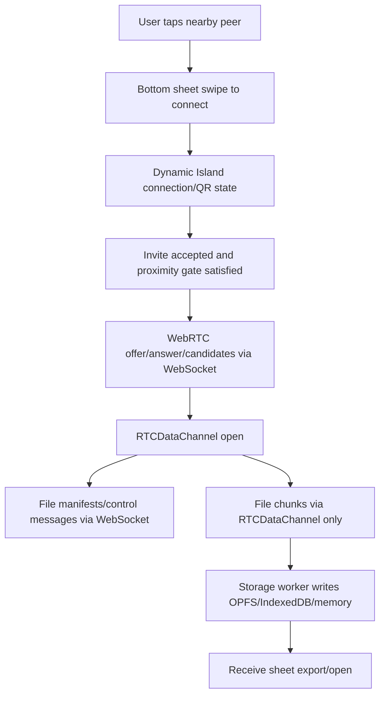

# Architecture Map: WebDrop audit 1.0.11

## Frontend
WebDrop is a static, Vercel-ready HTML/CSS/vanilla JavaScript application.

- Shell: `index.html` owns semantic landmarks, root containers, dialogs, sheets, tray controls, and Dynamic Island host markup.
- Styles: `css/base.css`, `css/layout.css`, `css/orbit.css`, `css/sheets.css`, `css/controls.css`, `css/responsive.css`, and docs/print styles split presentation by surface.
- Bootstrap/state: `js/app.js`, `js/core/controller.js`, and state/config modules orchestrate discovery, invite, verification, connection, transfer, locale, theme, and settings.
- UI: `js/ui/app-view.js` renders sheets, avatar controls, tray controls, receive state, haptics, and sheet focus/inert behavior. `js/ui/dynamic-island.js` renders connection, QR, and progress states.
- Transport: `js/services/signaling-adapter.js`, `js/services/mock-signaling-adapter.js`, `js/services/websocket-signaling-adapter.js`, `js/services/webrtc-transport.js`, and `js/services/data-channel-transfer-protocol.js`.
- Proximity: `js/services/proximity-engine.js`, QR token helpers, and capability detection are wired but real microphone/motion enforcement remains disabled by default.
- Storage/workers: `workers/storage-worker.js` receives chunks and writes through OPFS/IndexedDB/memory capability paths. Hash/chunk bookkeeping stays off the main UI thread where possible.
- Assets/docs: `assets/`, `docs/`, generated PDF helpers, and screenshot helpers are static deliverables.

## Backend
The backend is isolated in `aws cloud server/` and is not bundled into the static frontend.

- Runtime: Node.js 20 style service using `ws`.
- Entrypoint: `src/server.js`.
- WebSocket hub: `src/signaling-hub.js` handles `/ws`, presence, invites, proximity telemetry, RTC signaling, chat, transfer manifests/control messages, QR token coordination, heartbeat, and cleanup.
- Validation: `src/message-schema.js` rejects malformed and oversized control messages. WebSocket binary frames and file bytes are not accepted.
- TURN: `src/turn-provider.js` generates temporary Cloudflare TURN `iceServers` from server-side environment variables and never logs long-term credentials.
- Ops: nginx, systemd, Certbot, EC2 install/deploy/smoke scripts, mock network config, env examples, and README live inside `aws cloud server/`.

## Runtime Flow

## Test Map
- Root static/smoke/unit: `npm run check`, `npm test`, `npm run verify`.
- Root security/release: `npm run audit:secrets`, `npm audit --omit=dev`, `git diff --check`.
- AWS server: `npm --prefix "aws cloud server" run check`, `npm --prefix "aws cloud server" test`, `npm --prefix "aws cloud server" audit --omit=dev`.
- Browser QA: in-app browser against `http://127.0.0.1:4178/` with iPhone-sized viewport matrix.
- Script sanity: `python3 -m py_compile scripts/generate-demo-pdfs.py scripts/build-avatar-frames.py`.

## Boundaries
- WebSocket is coordination only: presence, invite, proximity metadata, RTC signaling, chat, and transfer control.
- File bytes never pass through WebSocket or the AWS server.
- TURN credentials are server-generated and temporary.
- Real device permissions for mic/camera/motion remain opt-in and cannot be fully validated in desktop browser emulation.
