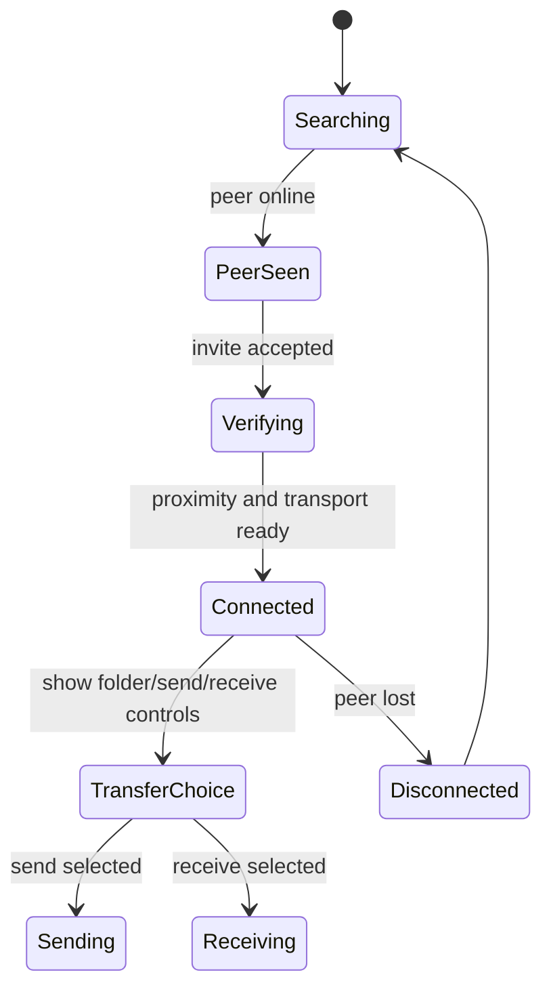

# Orbital UI State Gating Verification

Date: 2026-06-14

Scope: verification/docs asset only. App source was inspected but not modified.

## Current Local Evidence

- Local URL checked: `http://localhost:4179/`
- Page title: `WebDrop v2`
- Lobby screenshot: `assets/screenshots/mobile-lobby.png`
- Connected screenshots: `assets/screenshots/mobile-connected-360.png`, `assets/screenshots/mobile-connected-390.png`, `assets/screenshots/mobile-connected-430.png`
- Self marker: centered in the orbit in lobby state.
  - Delta from orbit center: `(0, 0)`
- Send/receive/folder tray:
  - Hidden in lobby state.
  - Visible only after invite acceptance and proximity verification reach connected state.

## Reference Evidence

- Reference URL checked: `https://web-drop-lyart.vercel.app/`
- Page title: `ウェブドロップ | WebDrop`
- Screenshot: `assets/screenshots/reference-web-drop-lyart-home.png`
- Reference use: interaction/state reference only. Do not clone its visual design.
- Relevant observed behavior: send and receive choices are presented as an action dialog, while primary transfer action remains disabled until the app has a usable target/state.

## Required State Model

## Target UI Rule

The orbital self/user icon must remain centered in every state. Folder, send, and receive controls must be hidden during searching, online-only, invite, and verification states. They should appear only after the UI reaches a connected state where a peer is ready for transfer.

## Historical Gap

The old static preview gap has been removed with the corrected `index.html` app. The active app centers the self/user avatar and hides `[data-connection-tray]` until connected state.
