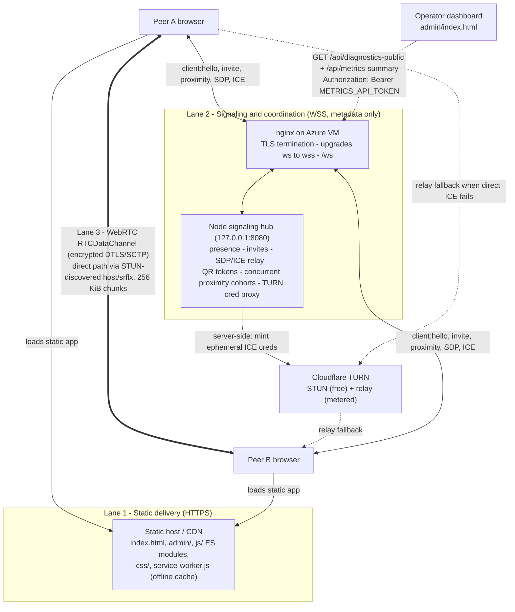

# WebDrop Architecture

## Current repository state

This checkout now contains a first-run static, modular WebDrop v2 app plus architecture notes.

- `index.html` is the active static app shell.
- The current app/package/service-worker version is `1.0.87`.
- The earlier `proximity_architecture_monkeytype_v2.html` page was removed during the corrected rebuild.
- `docs/implementation-checklist.md` is the current production-readiness source of truth.
- For a from-scratch tour of the app and the underlying technologies, see `docs/webdrop-app-documentation.md` (how the app is built) and `docs/webdrop-concepts-revision-guide.md` (study/revise the concepts + multi-device pairing Q&A).
- `js/` contains the app state machine, controller, adapters, proximity, transport, transfer, storage client, and UI renderer.
- `js/admin/` contains the readiness/live-testing console (`readiness.js`), the shared operations localization (`operations-i18n.js`), and the authenticated diagnostics client (`diagnostics-api.js`). The orphaned legacy `js/admin/diagnostics.js` module and `css/diagnostics.css` were removed; do not reintroduce them.
- `admin/index.html` is the operator dashboard (Readiness + Live testing tabs). It reads bounded operational metadata — signaling clients, active pairs, proximity sessions, protocol thresholds, device acoustic telemetry, and failure analysis — from the single authenticated `/api/diagnostics-public` endpoint. `admin/diagnostics.html` is now only a redirect to `admin/index.html?tab=live`. The dashboard never requests this browser's microphone and never runs a local loopback lab.
- `css/operations.css` and `js/admin/operations-i18n.js` are the shared visual and English/Japanese foundation for both admin pages.
- `js/storage/storage-client.js` contains the active receive-side storage ladder: deferred IndexedDB chunks with StreamSaver export on Download, iPhone/iPad Blob fallback, direct-stream compatibility fallback, and a 500 MB receive-session cap.
- `azure cloud server/` contains the deployable signaling backend package for WSS metadata, QR token issuance, TURN credential proxying, and enforcement policy.
- `graphify-out/` exists, but the current index may be stale or unrelated. Follow `AGENTS.md`: try graph traversal first, record stale results when encountered, then keep any direct reads scoped to the task.

The deployed site at `https://web-drop-lyart.vercel.app/` is a reference surface only. It should inform product behavior, interaction vocabulary, and visual intent, but it is not a source to clone into this repository.

## Product model

WebDrop is a browser-native nearby file-transfer system. It should feel like a zero-install AirDrop-style flow while staying inside normal web platform constraints.

The product separates three concerns:

1. Static delivery: HTML, CSS, JavaScript, assets, and the incremental hash helper served over HTTPS.
2. Signaling and coordination: WebSocket metadata for presence, invites, session state, proximity evidence, offers, answers, and ICE candidates.
3. Payload transport: encrypted browser-to-browser file chunks over WebRTC `RTCDataChannel`.

The signaling server is a coordinator, not a file server. It must never accept or relay file bytes.

## System architecture diagram

The three lanes are independent: the static lane delivers code, the signaling
lane (`ws://` upgraded to `wss://` at nginx) carries only small JSON metadata,
and the data lane carries encrypted file bytes peer-to-peer. STUN is used to
discover a direct path; Cloudflare TURN relays only when the direct path fails.
The operator dashboard reads bounded diagnostics over a single token-gated
endpoint. Proximity pairing runs as many concurrent bounded acoustic cohorts
(see "Proximity and trust"). The committed SVGs under `assets/diagrams/`
(`webdrop-system-map.svg` and friends) remain valid high-level views; this
Mermaid diagram is the current canonical architecture reference.

## Runtime lanes

### Static client lane

The browser client owns:

- Orbital discovery UI.
- Local device identity and capability checks.
- QR, audio, motion, and manual pairing ceremonies.
- WebRTC peer setup.
- Chunked file read and send.
- Chunked receive into deferred browser storage, explicit Download or Open actions, iPhone/iPad Blob fallback, and receive-sheet status actions.
- User-facing state transitions.

### Signaling lane

The WebSocket lane owns:

- Online presence.
- Invite and acceptance messages.
- Short-lived pairing sessions.
- Proximity telemetry summaries.
- WebRTC SDP and ICE exchange.
- TURN credential minting policy, if needed.

It must reject binary payloads, cap message sizes, validate origin/session tokens, and rate-limit pairing attempts.

The `/api/diagnostics-public` endpoint powers the operations dashboard with
bounded metadata only: connected-client summaries, proximity-session state,
acoustic capabilities and decoded evidence, protocol thresholds, and recent
event summaries. It now requires the metrics bearer token used by
`/api/metrics-summary` (the previously separate, identically-shaped
`/api/diagnostics-snapshot` route was folded into it). There is no IP allowlist:
any source address may read it with a valid token. The endpoint never exposes
TURN credentials, QR tokens, raw microphone samples, or transferred file bytes.

### Data lane

The data lane uses WebRTC:

- Control channel for transfer metadata, progress, ACKs, pause/resume, and cancellation.
- File channel for ordered binary chunks.
- STUN for direct path discovery.
- TURN only when direct connectivity fails.

Direct WebRTC can allow larger transfers after receiver storage checks. TURN relay mode should be visible to users and capped because relay traffic has server bandwidth cost.

## Backend hardening (current)

The signaling backend was hardened against resource leaks and oversized frames:

- The WebSocket payload cap is enforced at the protocol layer: `ws` is created with `maxPayload: MAX_JSON_BYTES`, so oversized or binary frames are rejected before buffering instead of allowing several times the documented limit through to the app check.
- The per-IP HTTP rate-limit map is swept periodically (`TokenBucket.sweep` on a 60 s interval) so it cannot accumulate one entry per source address forever.
- The Cloudflare TURN credential cache is pruned and capped.
- Peer-list broadcast serializes the frame once (`broadcast()` is O(n), not O(n²)); TURN-token authentication is an O(1) `Map` lookup.
- Proximity-session timers (`timer`, `failTimer`) are cleared on shutdown (`close()`), and the cohort sets are emptied.
- `sdp` is in the logger's redaction pattern, alongside `authorization`, `token`, `secret`, `credential`, `iceServers`, etc.

These are implemented in `azure cloud server/src/{server.js,signaling-hub.js,turn-provider.js,logger.js}` and covered by the backend tests.

## Frontend hardening (current)

- Received-file previews are XSS-safe: peer-declared dangerous MIME types (`text/html`, `image/svg+xml`, any `text/*`, XML) are **download-only** and never opened in-page. The shared policy is `js/utils/received-files.js` (`isPreviewableReceivedItem`).
- The received-file object-URL leak was fixed (URLs are revoked).
- Dead code was removed: the orphaned `js/admin/diagnostics.js` and `css/diagnostics.css`, and their entries in `service-worker.js`.

## Orbital UI contract

The orbital UI is a state machine, not decorative motion.

The self/user icon is always centered. It represents the local browser session and must not orbit, drift, or be laid out as a peer. Other devices are placed around that fixed center according to their state.

Suggested rings:

- Searching: no confirmed peers; show scanning state around the centered self icon.
- Available: peer is online through signaling but not verified nearby.
- Invited: peer has an active short-lived pairing session.
- Verifying: QR, audio, motion, or manual ceremony is running.
- Connected: selected peer is ready for transfer.
- Transferring: connected peer has an active send or receive stream.
- Complete or failed: transfer ended with a clear next action.

Folder, send, and receive controls must only appear after the connected state. They should not be visible during searching, discovery, available-online, invite, or proximity-verification states. In the current app this is enforced by `data-mode="connected"` and the `[data-connection-tray]` element.

## Proximity and trust

Web browsers do not expose universal native nearby-device APIs across iOS Safari, Android Chrome, and desktop browsers. WebDrop therefore uses explicit pairing and confidence signals rather than pretending that online presence equals physical proximity.

Supported evidence can include:

- QR token exchange.
- Acoustic nonce or chirp verification.
- Motion or tilt correlation.
- User invite and explicit acceptance.
- WebRTC path quality and latency.
- Server-observed coarse network hints.

QR should remain the reliable fallback when microphone, motion, or audio playback permissions fail.

Acoustic verification uses a coded, device-negotiated high-frequency band. The
current server policy allocates the `18.6-19.4 kHz` range for physical iPhone
testing, with guarded transmit slots and per-device chirp codes. Anonymous
sessions continuously record one ceremony buffer and allocate one transmit slot
per cohort participant in the shared band. Each participant emits only in its
slot and decodes all peer slots after the frame. The server pairs devices only
when strongest-signature reports are reciprocal, winner confidence is
unambiguous, and bump timestamps are inside the match window. The winner-margin
guard fails safe: a missing/non-finite confidence margin fails the check rather
than passing by default (`ACOUSTIC_WINNER_MARGIN = 0.04`).
The score threshold is necessary but not sufficient: server verification also
requires explicit ultrasound, bump, and tilt evidence, and rejects bump timing
outside the server-issued ceremony window.
If the initial anonymous join window contains only one device, the server keeps
that identity-hidden session open until the session's revisioned late-tap
deadline (6 seconds from the first tap by default) and starts it after a short
settle when a late second device arrives.

### Concurrent proximity cohorts (capacity model)

The hub supports MANY concurrent proximity sessions rather than one global
session (`openProximitySessionIds`, commit `25acf17`). Each cohort is kept small
so its acoustic time slots stay reliable, and a global cap bounds the total:

- `MAX_TOTAL_PROXIMITY_PARTICIPANTS` (default **100**): a global cap; joins
  beyond it are rejected cleanly with `proximity:session:failed`
  `reason: "capacity_reached"`.
- `MAX_PROXIMITY_SESSION_CLIENTS` (default 6): the per-cohort cap, **clamped** to
  a slot-floor-derived ceiling. A coded chirp needs ~520 ms + 80 ms guard, so the
  default 6,000 ms acoustic window has a theoretical ceiling of 10 slots; the
  configured cap remains 6 devices for conservative three-pair cohorts.
- New additive wire fields `acousticBandIndex` / `acousticBandCount` on
  `proximity:session:start`, plus cross-cohort start staggering
  (`ACOUSTIC_SESSION_STAGGER_MS`) and optional sub-band splitting
  (`ACOUSTIC_MAX_CONCURRENT_SUBBANDS`) when the band is wide enough.

So 100 participants ≈ 17 concurrent 6-person cohorts ≈ up to ~50 pairs. The
software allows this, but ~50 co-located pairs sharing one ~800 Hz band in one
room is acoustically contended; real reliability is a physical-device question.
The path to 10,000 is a config bump plus Redis/shared presence and multi-node
sticky WS balancing (see `azure cloud server/README.md`). The exact scoring,
slot floor, and de-confliction rules are in
`docs/webdrop-proximity-scoring-and-tdma.md`.

### Dynamic Island ceremony

The safe-area-aware Dynamic Island is a presentation layer over the existing state machine:

- `verifying + qr-display`: the invite initiator renders a backend-issued one-time QR token.
- `verifying + qr-scan`: the accepting iPhone requests camera access from an explicit button and scans with `BarcodeDetector`.
- `verifying + sound-motion`: either peer can coordinate a fallback message and continue with the synchronized chirp, motion, bump, and tilt ceremony.
- `connected`: the island briefly shows both static profile icons and a restrained flow signal, then collapses so the orbital workspace remains usable.
- `disconnecting`: camera tracks and island animation are closed before the peer/session state is cleared.

Peer presence exposes only a sanitized platform summary. QR is selected automatically only when both peers report iPhone capability and production QR pairing is enabled. QR values come exclusively from the signaling server's one-time token provider; the older unsigned frontend token helper is not used for production pairing.

TURN credential requests are separately protected by an ephemeral access token returned after `client:hello`. The frontend sends that token only to `/api/ice-servers`; the long-lived Cloudflare TURN key remains server-side.

## Storage model

The active receive path writes incoming `RTCDataChannel` chunks into IndexedDB on capable non-iOS browsers. This does not start a download while the file is arriving. After completion, the receive badge and sheet expose an explicit Download action. That user action streams the stored chunks through the self-hosted StreamSaver helper into the browser download pipeline. iPhone and iPad Safari use capped Blob assembly and expose Open, which previews the file in a separate tab without navigating WebDrop away. Direct receive-time streaming remains only a compatibility fallback when IndexedDB is unavailable.

Each send session is capped at 500 MB and each receive session is capped at 500 MB, so a connected pair can send up to 500 MB in each direction at the same time. The Blob fallback has a lower memory-safety cap and is intended for compatibility, not as the large-file path.

The earlier durable worker writer and OPFS path are no longer used by the app runtime. IndexedDB chunks are cleaned when the page exits, with a 24-hour stale-record prune as recovery. Browser security still means WebDrop cannot read the final Downloads file path after Download.

## Failure policy

Failures should move the user to the next viable path:

- Microphone denied: offer QR pairing.
- Motion unavailable: continue with QR or explicit invite.
- Direct WebRTC fails: try TURN relay.
- TURN relay selected: show relay-mode cap before transfer.
- Storage estimate insufficient: reject before accepting the incoming file.
- Peer disconnects: keep partial state only if resume support exists; otherwise clear it predictably.

## Remaining production activation

The architecture is code-ready for deployment experiments, but production is not active from this checkout alone. Remaining work is operational:

1. Deploy and verify the Azure signaling backend with exact allowed origins, TLS, systemd, nginx, firewall rules, and protected metrics.
2. Rotate and verify Cloudflare TURN credentials on Azure VM only; no long-lived TURN secrets belong in frontend files.
3. Configure real WSS and TURN URLs in `js/config/runtime-config.js` and enable flags in the staged order in `docs/production-activation.md`.
4. Calibrate QR/acoustic/motion evidence on physical iOS and Android devices before enabling server-side proximity enforcement.
5. Prove direct and TURN WebRTC transfers between two browsers, including large receives, cancellation, retry, and storage exhaustion.
6. Load-test signaling and add shared session/presence state before horizontal scaling.
