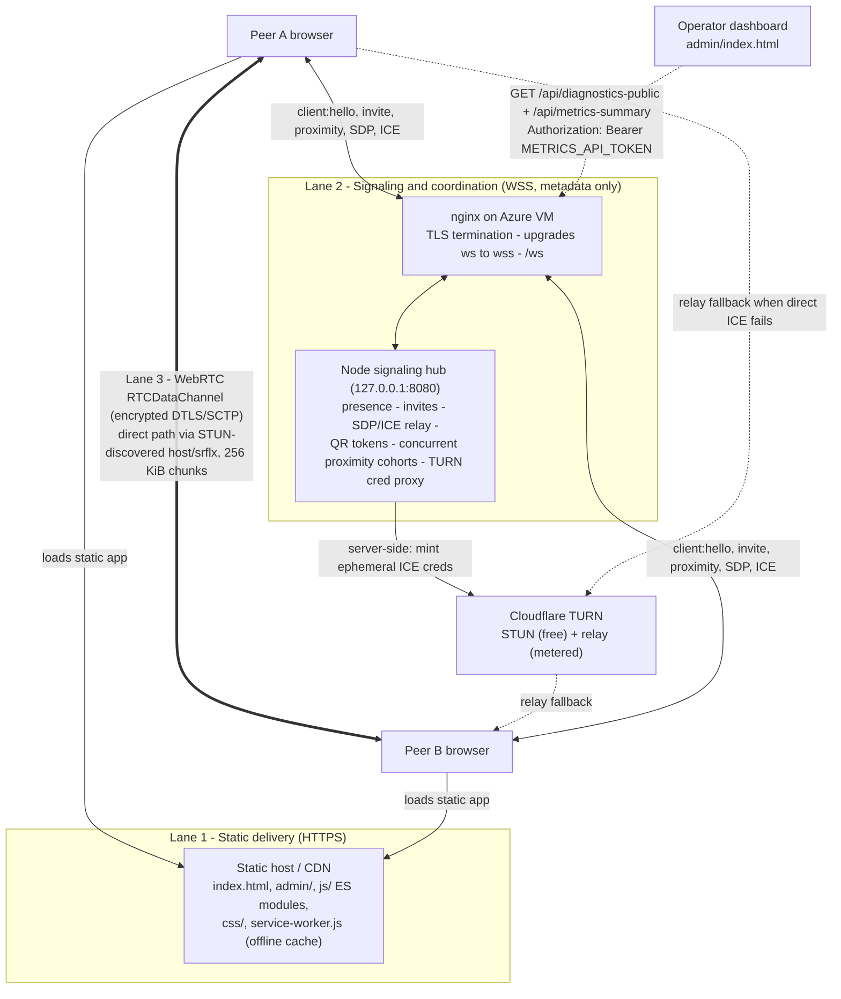
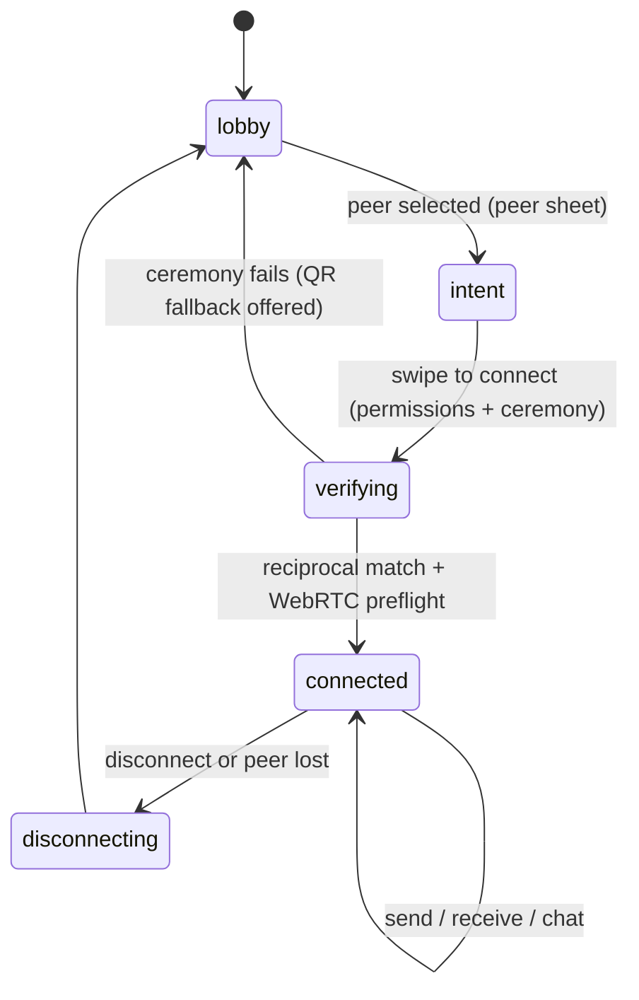

# WebDrop App Documentation

App version: `1.0.86`
Repository: `/Users/mfuad16/Documents/web_drop_v2`
Primary entrypoints: `index.html` + `js/app.js` (app), `admin/index.html` + `js/admin/readiness.js` (operations)

This document explains **what WebDrop is, how it is built, and how every
technology in it works** — written so a motivated beginner can follow it, with
concrete examples and the reason WebDrop chose each piece.

It is one of three core docs:

- **This doc** — how the app is built and how it works end to end.
- [`webdrop-concepts-revision-guide.md`](webdrop-concepts-revision-guide.md) — a
  first-principles study/revision guide for the underlying technologies
  (TURN, STUN, ICE, WebSocket vs WSS, WebRTC, TDMA/Aloha, …) **plus** a
  multi-device pairing Q&A. Use it to *revise the concepts*; use this doc to
  *understand the implementation*.
- [`webdrop-complete-guide.md`](webdrop-complete-guide.md) — the detailed
  engineering/QA/production-handoff reference, with UI screenshots.

For the precise proximity scoring and ultrasonic scheduling numbers, see
[`webdrop-proximity-scoring-and-tdma.md`](webdrop-proximity-scoring-and-tdma.md).

---

## 1. What WebDrop does

WebDrop is a **browser-native nearby file-transfer app** — AirDrop-style, but
with zero install. You open a web page, you see nearby devices orbiting your own
avatar, you pair with one by physically tapping the phones together (or scanning
a QR code), and then files move **directly browser-to-browser**, encrypted, over
WebRTC.

The user journey:

1. **Open the page.** A static web app loads. Your own avatar sits in the centre
   of an "orbit"; candidate peers appear around it.
2. **Pick a peer and press Connect.** This is the only place permissions are
   requested (microphone + motion on iOS need a real user tap).
3. **Pairing ceremony.** Both phones emit and listen for inaudible ultrasonic
   chirps, and you bump/tilt the phones together. The server only reveals the two
   identities to each other once the evidence is reciprocal and consistent.
4. **Connected.** Now — and only now — the send / receive / chat / disconnect
   dock appears.
5. **Transfer.** File bytes flow over an encrypted WebRTC `RTCDataChannel`,
   directly between the two browsers (or via a TURN relay if a direct path is
   impossible). The signaling server never sees a single file byte.

Three rules define the whole product:

- **Trust before controls** — no transfer UI until a verified connection exists.
- **Metadata on signaling, bytes on WebRTC** — the server coordinates, it never
  relays files.
- **Receiving must never trigger a surprise download** — bytes are buffered
  safely and only exported when the user taps Save/Download.

---

## 2. Technology stack at a glance

| Layer | Technology | Where in the repo | Why WebDrop uses it |
| --- | --- | --- | --- |
| Static UI | HTML, CSS, vanilla JS | `index.html`, `css/`, `js/` | Zero-install, runs in any modern browser, no framework runtime |
| Code structure | ES modules | `js/**/*.js` (`import`/`export`) | Native module loading, no bundler |
| Offline / caching | Service Worker | `service-worker.js` | App shell loads offline; controlled cache versioning |
| Signaling | WebSocket → WSS (TLS at nginx) | `js/services/websocket-signaling.js`, `azure cloud server/` | Bidirectional, low-latency metadata channel |
| Peer transport | WebRTC `RTCPeerConnection` + `RTCDataChannel` | `js/services/webrtc-transport.js`, `data-channel-transfer-protocol.js` | Direct, encrypted, peer-to-peer byte transport |
| NAT traversal | ICE + STUN + TURN | `js/services/turn-config.js`, `azure cloud server/src/turn-provider.js` | Find a working path between two NATed devices |
| Receive storage | IndexedDB + StreamSaver, Blob fallback | `js/storage/storage-client.js`, `vendor/streamsaver/` | Receive large files without holding them all in RAM |
| Proximity (sound) | Web Audio API ultrasonic chirps | `js/services/acoustic-proximity.js` | Prove two devices are in the same room |
| Proximity (motion) | DeviceMotion bump/tilt | `js/services/motion-proximity.js` | Confirm the user physically bumped the phones |
| Pairing scheduling | Server-arbitrated reservation TDMA | `azure cloud server/src/signaling-hub.js` | Let many devices chirp without colliding |
| QR fallback | `BarcodeDetector` + `jsQR` + `qrcode-generator` | `js/ui/dynamic-island.js`, `js/vendor/` | Universal pairing when audio/motion fail |
| Sender hashing | Incremental SHA-256 | `workers/incremental-sha256.js` | Verify file integrity without buffering the file |
| Backend runtime | Node.js + `ws` | `azure cloud server/src/` | Small, strict signaling coordinator |
| Edge | nginx + Certbot TLS, systemd, Azure VM | `azure cloud server/nginx/`, `systemd/`, `scripts/` | TLS termination, WSS upgrade, process supervision |
| Relay creds | Cloudflare TURN credential API | `azure cloud server/src/turn-provider.js` | Managed STUN/TURN; ephemeral creds only |

---

## 3. The three-lane architecture

WebDrop deliberately separates three concerns into independent "lanes". Keeping
them apart is what makes the system cheap, private, and reliable.



- **Lane 1 — Static delivery (HTTPS).** Plain HTML/CSS/JS served over HTTPS. No
  server-side rendering, no bundler.
- **Lane 2 — Signaling (WSS).** A `ws://` WebSocket that nginx upgrades to
  `wss://` (TLS). It carries only small JSON: presence, invites, the proximity
  ceremony, and the WebRTC handshake (SDP + ICE). **No file bytes, ever.**
- **Lane 3 — Data (WebRTC).** An encrypted `RTCDataChannel` between the two
  browsers. STUN discovers a direct path; Cloudflare TURN relays only if direct
  fails.

The canonical version of this diagram lives in
[`architecture.md`](architecture.md#system-architecture-diagram).

---

## 4. How each technology works, and why WebDrop uses it

Each subsection is implementation-focused. For the first-principles "what is this
and how does it work in general" explanation with analogies, see the matching
section of the [concepts revision guide](webdrop-concepts-revision-guide.md).

### 4.1 Static HTML / CSS / JS delivery (HTTPS)

**What it is.** The browser downloads three kinds of text files — HTML
(structure), CSS (appearance), JavaScript (behaviour) — and runs them. Nothing is
installed.

**How WebDrop uses it.** `index.html` is a fixed DOM "contract": a topbar, the
orbit stage with the centred `.identity-core`, the bottom sheets
(`role="dialog"`), the file `<input>`, and a toast region. The app never rebuilds
this structure from JS; instead `js/ui/app-view.js` flips attributes on the root
element:

```html
<div id="app" class="app-shell" data-mode="lobby" data-theme="light">
```

`data-mode`, `data-theme`, `data-locale`, `data-motion`, `data-transfer-state`,
and `data-sheet-open` form a compact state API that CSS reacts to. **Why:** it
keeps the app tiny and fast, and HTTPS is mandatory anyway because microphone,
motion, service workers, and WebRTC only work on a secure origin.

### 4.2 ES modules

**What it is.** The browser's native module system: files use `import`/`export`,
and `<script type="module">` loads the graph.

**How WebDrop uses it.** `index.html` loads `js/app.js`, which imports the store,
the view, the services, the transport, and the controller, then wires them
together — no webpack/rollup step. You will notice query-string versions in
imports, e.g. `import { AcousticProximitySensor } from "./acoustic-proximity.js?v=1.0.86"`.
That `?v=` is a cache-buster tied to the app version. **Why:** a small static app
doesn't need a build pipeline, and native modules give clean dependency
boundaries.

### 4.3 Service worker and offline

**What it is.** A background script the browser keeps even when the page is
closed; it can intercept network requests.

**How WebDrop uses it.** `service-worker.js` pre-caches the app shell
(`CACHE_NAME = webdrop-v2-static-1.0.86`) on install, serves code assets
network-first with a cache fallback, and **always** fetches
`js/config/runtime-config.js` fresh (`cache: "no-store"`) so the live endpoint
URLs are never stale. The orphaned diagnostics module/CSS were removed from its
asset list. **Why:** the app loads instantly and works offline for the UI shell,
while the configuration that points at the live server stays current.

### 4.4 WebSocket and the WSS/TLS upgrade

**What it is.** A WebSocket is a long-lived, two-way connection over a single TCP
socket; either side can send a message at any time. `wss://` is just WebSocket
over TLS (encrypted), the way `https://` is HTTP over TLS.

**How WebDrop uses it.** The browser opens `wss://…/ws`
(`js/services/websocket-signaling.js`). On the server, **nginx terminates TLS**
and forwards the upgraded connection to the Node process bound to
`127.0.0.1:8080` (`azure cloud server/src/server.js` → `signaling-hub.js`). The
first frame must be a `client:hello`; the server replies `connected` with a
`sessionId` and an ephemeral `turnAccessToken`. From then on, small JSON messages
flow: `peers`, `invite`, `proximity:*`, `rtc:signal`, `peer:disconnect`, …

The hub is strict: binary frames are rejected, `ws` is created with
`maxPayload = MAX_JSON_BYTES` so oversized frames are dropped before buffering,
every message is schema-validated (`message-schema.js`), and there are per-IP and
per-client token-bucket rate limits (`rate-limits.js`). **Why:** WebSocket is
perfect for tiny, frequent, bidirectional coordination messages — but it is
*not* the file lane (it has weak backpressure and would turn the server into an
expensive file relay).

### 4.5 WebRTC: `RTCPeerConnection`, SDP, ICE, NAT, STUN, TURN, DTLS/SCTP

This is the heart of WebDrop's data lane. WebRTC lets two browsers talk
**directly** to each other. WebDrop uses only the **data** part of WebRTC (no
camera/mic media streams over the connection).

**`RTCPeerConnection`** is the object that manages the whole peer link:
describing capabilities, gathering network candidates, testing paths, and hosting
data channels. `js/services/webrtc-transport.js` creates it with an `iceServers`
list fetched from the backend.

**SDP offer/answer.** SDP (Session Description Protocol) is a text blob that
describes "here is what I can do and how to reach me". The flow:

1. Sender `createOffer()` → `setLocalDescription(offer)` → sends the offer over
   WebSocket (`rtc:signal`).
2. Receiver `setRemoteDescription(offer)` → `createAnswer()` →
   `setLocalDescription(answer)` → sends the answer back over WebSocket.

The signaling server just relays these blobs between the two paired clients; it
never originates them.

**ICE / NAT / STUN / TURN.** Most devices sit behind NAT (a router sharing one
public IP), which blocks unsolicited inbound traffic. ICE (Interactive
Connectivity Establishment) solves this by gathering **candidates** and testing
them:

- `host` — your local LAN address.
- `srflx` (server-reflexive) — your public address as seen by a **STUN** server.
- `relay` — an address on a **TURN** relay server.

WebDrop fetches its ICE servers from `GET /api/ice-servers` (authenticated with
the ephemeral token). The backend (`turn-provider.js`) asks Cloudflare to mint
**short-lived** TURN credentials, so the long-lived Cloudflare key never reaches
the browser. If the backend is unreachable, `turn-config.js` falls back to
Cloudflare **STUN only** (`stun:stun.cloudflare.com:3478`). After connecting,
`classifyPathFromStats()` labels the path `direct` or `relay`, and the UI caps
relay transfers at 500 MB (relay bandwidth is metered).

**DTLS/SCTP encryption.** WebRTC data channels run SCTP over DTLS — meaning
every byte is encrypted in transit by the browser stack, automatically. WebDrop
still layers its own manifests, byte-count checks, and SHA-256 on top, because
encryption doesn't define *file boundaries* or *integrity*.

**Why WebRTC:** it is the only widely-supported browser API for direct,
encrypted, peer-to-peer byte transfer, and it keeps file bytes off the server.

### 4.6 `RTCDataChannel`, chunks, and backpressure

**What it is.** A message pipe inside an `RTCPeerConnection`. It can send strings,
`Blob`s, `ArrayBuffer`s, and typed arrays, ordered and reliable like TCP.

**How WebDrop uses it.** WebDrop opens **two** ordered channels
(`webdrop-control-v1` and `webdrop-file-v1`) so control metadata never blocks
file bytes. The sender slices each `File` into **256 KiB** chunks
(`DEFAULT_CHUNK_SIZE = 256 * 1024` in `data-channel-transfer-protocol.js`):

```js
const chunk = await file.slice(offset, offset + this.chunkSize).arrayBuffer();
```

It first sends a **manifest** (file ids, sizes, chunk counts, and per-file
SHA-256), then streams chunks while watching `RTCDataChannel.bufferedAmount`
(backpressure) so it doesn't overrun the receiver, browser buffer, or storage.
The receiver ACKs progress, can cancel/retry, and the sender waits for a
receiver byte-count/`file:verified` confirmation. Each send and receive session
is capped at 500 MB (`DEFAULT_SESSION_CAP_BYTES`). **Why 256 KiB:** small enough
to keep buffering and retry bookkeeping cheap on mobile, large enough to avoid
per-message overhead.

### 4.7 IndexedDB receive ladder + StreamSaver

**The problem.** The sender can stream a file from disk without loading it all,
but the **receiver** must avoid assembling a multi-hundred-MB file in RAM, and a
web page cannot silently write to disk.

**WebDrop's receive ladder** (`js/storage/storage-client.js`), in order of
preference:

1. **IndexedDB (capable non-iOS browsers):** each ordered chunk is written to
   IndexedDB **while receiving**, keyed by session/file/chunk index. No download
   starts yet.
2. On **Save/Download**, the stored chunks are streamed through the self-hosted
   **StreamSaver** helper (`vendor/streamsaver/mitm.html` + `sw.js`) into the
   browser's download pipeline.
3. **iPhone/iPad Safari:** a **capped Blob** fallback assembles chunks in memory
   and exposes Open (preview in a new tab) — capped because memory grows with the
   payload.
4. **Compatibility fallback:** direct receive-time StreamSaver writing only when
   IndexedDB is unavailable.
5. If no safe backend can hold the size, the file is **rejected before** bytes
   are accepted.

Current-session IndexedDB data is cleaned on page exit, with a 24-hour stale
prune as recovery. **Why:** this separates "transfer finished" from "download
started", keeps large files off the heap, and never surprises the user with a
download.

### 4.8 Web Audio API — ultrasonic chirps

**What it is.** The Web Audio API synthesizes and analyzes sound in the browser.

**How WebDrop uses it.** `js/services/acoustic-proximity.js` emits a coded chirp
in a near-ultrasonic band (`DEFAULT_CHIRP`: `durationMs: 112`,
`startFrequencyHz: 18600`, `endFrequencyHz: 19400`, `gain: 0.24`) and records the
microphone with **echo cancellation, noise suppression, and auto-gain control
turned off** (so the browser doesn't erase the high-frequency energy). Detection
isn't "was there noise?" — it measures **correlation** against the expected chirp
shape and an **energy margin** (chirp-band energy vs. nearby background), with
several fallbacks. The server picks the shared band and keeps it under a safe
fraction of the lowest device's Nyquist limit. **Why:** sound is short-range and
direction-ish, so hearing a peer's coded chirp is good evidence the two devices
are physically near each other. (Inaudibility/reliability are device-dependent —
see the concepts guide and the proximity doc.)

### 4.9 DeviceMotion — bump and tilt

**What it is.** `DeviceMotionEvent` reports accelerometer data. On iOS it
requires an explicit permission call from a user gesture.

**How WebDrop uses it.** `js/services/motion-proximity.js` detects a **bump** when
linear acceleration ≥ `BUMP_ACCELERATION_THRESHOLD` (10) **or** the
gravity-vector change ≥ 3.5, and a **tilt** when |beta| or |gamma| > 30°. These
become part of the proximity score and are also **mandatory** server-side
evidence. **Why:** "bump the phones together" is an intuitive, deliberate gesture
that's hard to trigger by accident, which raises confidence that the right two
phones are pairing.

### 4.10 Reservation TDMA (and why it's "Aloha-family")

**The problem.** If several nearby phones all chirp at once, their sounds collide
and nobody decodes cleanly — the classic *multiple access* problem on a shared
channel.

**WebDrop's answer.** Because there is already a signaling server that knows the
set of participants and can hand out synchronized timestamps, the server assigns
each device a **time slot** before anyone transmits. This is **reservation
TDMA** (Time Division Multiple Access): every phone records the whole ceremony
but only emits in its own slot, then decodes all peers afterward
(`exchangeSignatureChirps` in `js/services/proximity-engine.js`, scheduled by
`signaling-hub.js`).

It is **Aloha-family** because Aloha/Slotted-Aloha is the ancestor of all shared
random/slotted channel-access schemes. Slotted Aloha lets devices *gamble* on a
slot and back off on collision; WebDrop instead *reserves* slots centrally, which
is strictly more reliable for a small, known, server-coordinated cohort. (Framed
Slotted Aloha remains a conceivable fallback if there were ever no coordinator.)

**Why:** it lets up to a per-cohort cap of devices chirp in one room without
colliding, and it scales by opening **many concurrent bounded cohorts** (see
§7.3).

### 4.11 BarcodeDetector / QR fallback

**What it is.** QR codes encode a short string in a scannable image. The browser
can scan with the native `BarcodeDetector`, with `jsQR` as a JS fallback; WebDrop
generates codes with `qrcode-generator`.

**How WebDrop uses it.** When mic/motion/audio fail, one iPhone displays a
**one-time, server-issued** QR token (`qr-token-provider.js`); the other scans it
(`js/ui/dynamic-island.js`), and the server verifies issuer, scanner, expiry, and
replay before creating the pair. **Why:** QR needs only a camera and a screen, so
it is the universal fallback when the acoustic/motion ceremony can't run.

---

## 5. End-to-end architecture: how a session actually runs

### 5.1 Boot (`js/app.js`)

1. Build `initialState` from defaults + `localStorage` (device name, avatar, ring
   colour, theme, locale, motion preference).
2. Create the observable store (`js/core/state.js`: `getState`, `patch`,
   `update`, `subscribe`).
3. Create `AppView` (`js/ui/app-view.js`), which subscribes to the store.
4. Choose the signaling adapter: `MockSignalingAdapter` only for
   `?runtime=mock` on localhost; otherwise the real `WebSocketSignalingAdapter`.
5. Create proximity engine, TURN config, WebRTC transport, the receive
   `StorageClient`, and the transfer engine.
6. Create the controller (`js/core/controller.js`) with all dependencies.
7. Detect capabilities (`js/services/capabilities.js`), patch them into state,
   connect signaling.
8. Register the service worker (outside localhost).

`js/config/runtime-flags.js` is the safety gate: even though
`runtime-config.js` sets `productionSignaling`, `realProximityCeremony`,
`realTransfer`, and `qrPairing` to `true`, those only take effect if a valid
`wss://` URL is present.

### 5.2 Discovery → pairing → connected

1. Signaling emits `peers`; the view renders them around the centred self avatar.
2. The user taps a peer → controller stores `selectedPeerId`, opens the peer
   sheet.
3. The user swipes Connect → controller requests permissions (mic/motion/audio)
   **from that gesture**, joins an anonymous proximity session, and runs the
   ceremony.
4. The server schedules the cohort (slots, signatures, band), both devices
   emit/listen and capture bump/tilt, and each sends telemetry.
5. The server matches a **reciprocal, unambiguous, correctly-timed** pair and
   sends `proximity:match` to both with a `pairingId`.
6. The controller runs WebRTC preflight, transitions to `connected`, and the dock
   appears.
7. Files chosen by the sender flow over the file `RTCDataChannel`; the receiver
   buffers via the storage ladder and exposes Save/Open.

### 5.3 The signaling protocol (summary)

`client:hello` → `connected` (+ `turnAccessToken`) → `peers`. Routed messages
carry `targetId` and a `pairingId`. Protected types require an active pair, and
`rtc:signal` / `rtc:path-metric` / `chat:message` / `transfer:*` are additionally
**proximity-gated** until both peers are `verified` (when analysis is enabled).
Full message list: `azure cloud server/README.md` + `src/message-schema.js`.

---

## 6. The state machine

The repo's ideal explicit vocabulary is:

```text
idle → searching → available → inviting → verifying → connected → transferring → complete / failed
```

The current runtime uses a smaller set on the root element's `data-mode`:

```text
lobby → intent → verifying → connected → disconnecting
```

`transfer` is tracked as a progress object rather than its own mode. The single
most important gate is in `AppView.renderTray()`:

```js
const connected = state.mode === "connected" || state.mode === "disconnecting";
this.nodes.tray.hidden = !connected;
```

i.e. **the transfer dock only exists after a verified connection** — the
enforced version of "trust before controls".



See the SVG `assets/diagrams/webdrop-ui-state-machine.svg` and
[`orbital-ui-state-gating.md`](../assets/diagrams/orbital-ui-state-gating.md) for
the UI-gating verification asset.

---

## 7. Security model

### 7.1 Trust boundaries

The client trusts **only** direct user gestures in the current tab and the file
handles the user picked. It does **not** trust device display names, peer-declared
file names or MIME types, proximity metrics without server session binding, or
any message/SDP/ICE outside the expected pairing session or schema.

### 7.2 Concrete frontend hardening (current)

- **XSS-safe received-file previews.** `js/utils/received-files.js`
  (`isPreviewableReceivedItem`) makes peer-declared dangerous MIME types
  (`text/html`, `image/svg+xml`, any `text/*`, XML) **download-only** — they are
  never opened in-page where script could run. Only safe types (images, video,
  PDF) are previewable.
- **No object-URL leaks.** Received-file object URLs are revoked after use.
- **File names are escaped** before rendering.

### 7.3 Backend security + the concurrent-cohort capacity model

The Node hub enforces allowed origins, rejects binary frames, caps payloads at
the protocol layer (`ws maxPayload = MAX_JSON_BYTES`), schema-validates every
message, rate-limits per IP and per client, mints only **ephemeral** TURN
credentials, and **redacts** secrets in logs (`authorization`, `token`,
`credential`, `iceServers`, **`sdp`**, …). Resource-leak hardening: the per-IP
rate-limit map is swept, the TURN cache is pruned/capped, peer broadcast is O(n),
TURN-token auth is O(1), and proximity timers are cleared on shutdown.

**Concurrent proximity cohorts.** Instead of one global pairing session, the hub
runs many concurrent bounded cohorts (`openProximitySessionIds`, commit
`25acf17`):

- `MAX_TOTAL_PROXIMITY_PARTICIPANTS` (default **100**) — global cap; over it,
  joins fail cleanly with `reason: "capacity_reached"`.
- `MAX_PROXIMITY_SESSION_CLIENTS` (default 6) — per-cohort cap, **clamped** to a
  slot-floor ceiling (a ~600 ms slot floor in a 3,600 ms window ⇒ ~6 slots), so
  the scheduler can never create sub-floor acoustic slots.
- Cross-cohort de-confliction via start-time staggering and (when the band is
  wide enough) sub-band splitting; the assigned lane is reported as the additive
  `acousticBandIndex` / `acousticBandCount` fields on `proximity:session:start`.

So 100 participants ≈ 17 concurrent 6-person cohorts ≈ up to ~50 pairs. The
software *allows* this; whether ~50 co-located pairs sharing one ~800 Hz band in
one room are acoustically reliable is a physical-device question. The path to
10,000 is a config bump plus Redis/shared presence + sticky multi-node WS
balancing (`azure cloud server/README.md`).

### 7.4 Proximity enforcement and the fail-safe winner-margin guard

With `ENABLE_PROXIMITY_ANALYSIS=true` (live), the server blocks RTC/chat/path/
transfer routing until both peers reach a `verified` decision. Verification needs
a score ≥ 55% **and** mandatory ultrasound, bump, and tilt evidence, reciprocal
signatures, valid timing, and an unambiguous winner. The winner-margin guard
**fails safe**: a missing/non-finite `acousticConfidenceMargin` *fails* the check
rather than passing by default (`ACOUSTIC_WINNER_MARGIN = 0.04`).

### 7.5 Diagnostics access

The operator dashboard reads **one** authenticated endpoint,
`GET /api/diagnostics-public`, which requires the `METRICS_API_TOKEN` bearer (the
old `/api/diagnostics-snapshot` route was merged into it; there is no IP
allowlist). The payload is metadata-only — never TURN credentials, QR tokens, raw
microphone audio, or file bytes. On the operator's machine the token auto-fills
from the gitignored `js/config/local-admin-token.js` (`WEBDROP_ADMIN_TOKEN`);
remote operators paste it (kept only in `sessionStorage`).

---

## 8. Operations dashboard

`admin/index.html` (driven by `js/admin/readiness.js` via `diagnostics-api.js`)
has two tabs: **Readiness** (environment/health summary from `/readyz`) and
**Live testing** (the bounded device/pair/cohort telemetry from
`/api/diagnostics-public`, plus single-device acoustic diagnostics via
`admin:monitor:*`). `admin/diagnostics.html` is now just a redirect to
`admin/index.html?tab=live`. The dashboard never opens its own microphone.

---

## 9. Build, test, run

```bash
# Static app (repo root)
npm run check        # static/secret asset scan (scripts/check-js.mjs)
npm test             # node --test tests/*.test.mjs
npm run test:e2e     # Playwright UI / permission / transfer / relay
npm run serve        # local static server on 127.0.0.1:4178

# Signaling backend
cd "azure cloud server"
npm run check        # node --check src/*.js
npm test             # message schemas, env validation, TURN provider, proximity scaling
npm start            # node src/server.js
```

Health checks on the VM: `GET /healthz`, `GET /readyz`, `wss://…/ws`,
`GET /api/ice-servers`. The deploy/TLS/start-stop scripts live in
`azure cloud server/scripts/`.

### Generated assets

- `output/screenshots/ui-elements-{en,ja}/` — UI captures used by
  `webdrop-complete-guide.md`, produced by `scripts/capture-ui-elements.cjs`.
  The UI hasn't changed materially; **do not** regenerate these for a docs pass.
- `output/pdf/webdrop-demo-{en,ja}.pdf` — **demo transfer payloads** (sample
  files to send during testing), generated by `scripts/generate-demo-pdfs.py`.
  These are not the rendered guide.
- The complete guide can be exported to PDF by rendering its Markdown with a
  pipeline that honours its `page-break` CSS (see its "Print and PDF Render
  Guidance" section); there is no committed script for that export.

---

## 10. Where to go next

- Revise the underlying concepts and read the multi-device pairing Q&A:
  [`webdrop-concepts-revision-guide.md`](webdrop-concepts-revision-guide.md).
- Exact proximity numbers and the TDMA schedule:
  [`webdrop-proximity-scoring-and-tdma.md`](webdrop-proximity-scoring-and-tdma.md).
- Full engineering/QA/handoff detail with screenshots:
  [`webdrop-complete-guide.md`](webdrop-complete-guide.md).
- Architecture invariants and the canonical diagram:
  [`architecture.md`](architecture.md).
- Backend protocol, capacity knobs, deployment:
  [`../azure cloud server/README.md`](../azure%20cloud%20server/README.md).
