# WebDrop Complete Technical Guide

Version: repository guide authored for WebDrop v2 static prototype  
Scope: `/Users/mfuad16/Documents/web_drop_v2`  
Primary app entrypoint: `index.html` and `js/app.js`

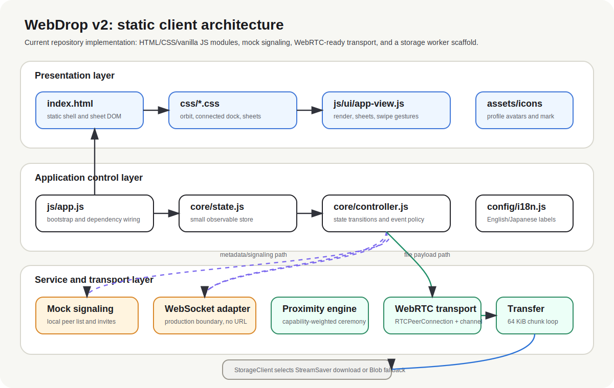

## How to read this guide

This guide is written for product, engineering, QA, and future backend implementation work. It intentionally separates the current prototype from the production architecture WebDrop is designed to grow into.

The current repository is a static browser application. It ships an HTML shell, modular vanilla JavaScript, CSS for the orbit and sheets, a mock signaling adapter, a WebSocket signaling adapter boundary, a WebRTC transport scaffold, a transfer progress simulator, and a receive storage worker scaffold. The app already models the important product boundaries: discovery and trust happen before file controls appear; signaling carries metadata; file bytes belong on an `RTCDataChannel`; and large receives should move toward worker-backed storage rather than one giant in-memory object.

The production roadmap sections describe the backend and browser-work needed to turn those boundaries into a real multi-device transfer system.

Print/render note: this document uses HTML page breaks between major sections. When rendered with a Markdown-to-PDF pipeline that honors `<div class="page-break"></div>` or `page-break-after`, it should produce 20+ pages. See the final render guidance section for CSS and export assumptions.

<div class="page-break" style="page-break-after: always;"></div>

## 1. Product Overview

WebDrop is a browser-native nearby file-transfer experience. The product intent is close to AirDrop in feel: a user opens a web page, sees nearby candidate devices, confirms a trusted connection, and transfers files without installing a native application.

The important constraint is that WebDrop lives inside the normal web platform. Browsers do not provide a single universal nearby-device API across iOS Safari, Android Chrome, desktop Chrome, Firefox, and Safari. WebDrop therefore treats "nearby" as a confidence model instead of a magical ambient capability. A candidate can appear through signaling, but it should not become trusted until the user performs a pairing action and the app collects enough proximity evidence.

The current prototype expresses that product model through an orbital lobby:

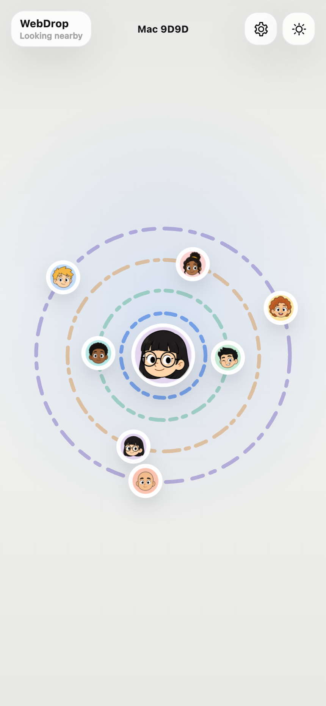

The center avatar is the local device. Orbiting avatars are candidate peers. The file dock is absent on first load, which is a deliberate product rule: sending, receiving, chat, and disconnect controls only appear after a verified connection.

The same layout works in Japanese:

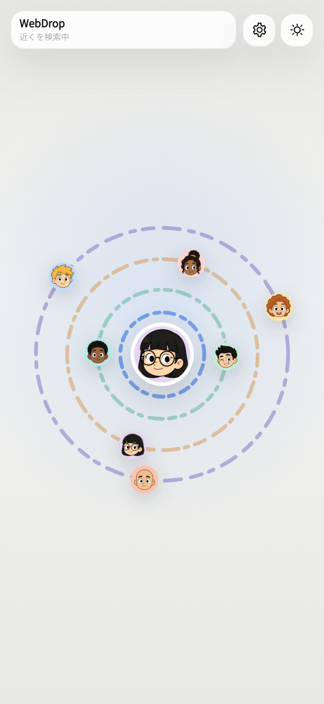

WebDrop is not trying to be a cloud drive. Its primary transfer path should be browser-to-browser. A server helps devices find each other, exchange negotiation metadata, and obtain relay credentials when needed. The server should not receive file payloads.

### Product goals

- Make nearby sharing feel immediate, visual, and low-friction.
- Avoid showing file-transfer controls before trust is established.
- Keep the self device visually anchored while peers orbit around it.
- Use WebRTC for encrypted peer data when possible.
- Use TURN relay only as a fallback and disclose relay limitations.
- Store received chunks incrementally so large files do not require one large memory allocation.
- Preserve an accessible fallback path when microphone, motion, QR, or direct networking features are unavailable.

### Problem statement

The web can deliver a zero-install transfer UI, but the hard parts are coordination, trust, networking, and storage. Users think in terms of "send this to that nearby device." Browsers think in terms of secure origins, permission prompts, NAT traversal, ICE candidates, file object reads, worker messages, storage quotas, and network paths that may or may not be direct.

WebDrop's architecture exists to translate between those worlds. The UI presents a calm nearby-device model. The runtime enforces explicit gates. The transport layer negotiates peer connectivity. The storage layer receives data safely. The backend roadmap provides the missing production coordination layer.

<div class="page-break" style="page-break-after: always;"></div>

## 2. Current Repository Map

The active implementation is static and module-based. These are the files most directly involved in runtime behavior:

| Area | Files | Responsibility |
| --- | --- | --- |
| Static shell | `index.html` | DOM structure, topbar, orbit stage, sheets, file input, toast |
| Bootstrapping | `js/app.js` | creates store, view, services, transport, storage worker, and controller |
| State | `js/core/state.js` | small observable store with `getState`, `patch`, `update`, and `subscribe` |
| Controller | `js/core/controller.js` | event handling, UI state transitions, connection gate, file selection, mock send, disconnect |
| UI renderer | `js/ui/app-view.js` | DOM rendering, sheet animation, peer orbit placement, swipe controls, translations |
| Capabilities | `js/services/capabilities.js` | detects secure context, mic, motion, WebRTC, OPFS, IndexedDB, worker support |
| Proximity | `js/services/proximity-engine.js` | computes a prototype confidence score from capability-derived metrics |
| Signaling mock | `js/services/mock-signaling.js` | supplies demo peers and emits invite/accept telemetry events |
| Signaling boundary | `js/services/websocket-signaling.js` | WebSocket adapter shape for future production endpoint |
| TURN/STUN | `js/services/turn-config.js` | returns current STUN config and future relay policy |
| WebRTC | `js/services/webrtc-transport.js` | creates an `RTCPeerConnection` and ordered `RTCDataChannel` during preflight |
| Transfer | `js/services/transfer-engine.js` | iterates selected files in 64 KiB slices and reports progress |
| Storage client | `js/storage/storage-client.js` | request/response wrapper around the storage worker |
| Storage worker | `workers/storage-worker.js` | detects OPFS/IndexedDB/memory and currently stores chunks in memory |
| Offline cache | `service-worker.js` | caches static files and demo PDFs outside localhost |

The existing `docs/architecture.md` and `docs/engineer-guide.md` are concise architecture notes. This guide is the expanded technical package.

The local Graphify index was checked first, but it appears stale or unrelated for this checkout: it references a missing `src/` tree and anime-provider nodes from a different application. For that reason, this guide uses scoped direct reads of the files listed above.

### Current app composition

`js/app.js` wires together the application in a simple dependency graph:

1. Build `initialState` from defaults and `localStorage`.
2. Create the store with `createStore`.
3. Create `AppView`, which subscribes to store changes.
4. Create mock signaling and a future WebSocket adapter.
5. Create proximity, TURN config, WebRTC transport, storage worker, and transfer engine.
6. Create the controller with all dependencies.
7. Detect capabilities, patch them into state, and connect mock signaling.
8. Register the service worker outside localhost.

That architecture is deliberately small. There is no bundler, no framework runtime, and no server dependency for the prototype path. The tradeoff is that production networking and receive storage are still skeletal.

<div class="page-break" style="page-break-after: always;"></div>

## 3. Static App Shell

`index.html` is the stable DOM contract for the application. It contains the topbar, orbit scene, identity core, connection tray, peer sheet, settings sheet, information sheet, send sheet, receive sheet, chat sheet, file input, and toast.

The root element is:

```html
<div id="app" class="app-shell" data-mode="lobby" data-theme="light">
```

`AppView.render()` updates this element with runtime attributes:

- `data-mode`: current UI mode such as `lobby`, `intent`, `verifying`, `connected`, or `disconnecting`.
- `data-theme`: `light` or `dark`.
- `data-locale`: `en` or `ja`.
- `data-motion`: `on` or `paused`.
- `data-transfer-state`: `transferring` or `idle`.
- `data-sheet-open`: whether a modal bottom sheet is visible.

Those attributes are a compact UI state API. CSS can express major mode changes without requiring JavaScript to manually toggle every class.

### Topbar

The topbar shows the WebDrop brand/status, the local device name, and settings/theme buttons.

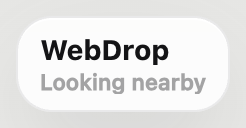

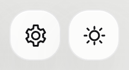

The connection label starts as "Looking nearby" and becomes a connected-peer label after verification. In `AppView.render()`, the label is derived from `connectedPeerId`. This is important because the user sees connection state without needing to open a sheet.

### Orbit scene

The orbit scene contains four SVG rings, an empty peer-orbit container, and the identity core. The local device is not a peer. It is centered in `.identity-core`, and orbiting peer nodes are rendered into `[data-peer-orbits]`.

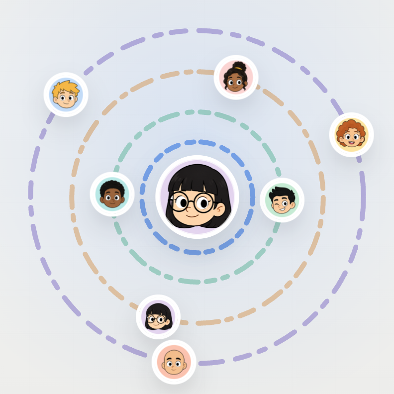

### Bottom sheets

Sheets are real DOM sections with `role="dialog"` and `aria-modal="true"`. They are hidden by default and animated by `AppView.showSheet()` and `AppView.hideSheet()`.

The current sheets are:

- Peer actions sheet.
- Settings sheet.
- Information sheet.
- Send sheet.
- Receive sheet.
- Chat sheet.

The shared backdrop is `[data-backdrop]`; clicking it emits `close-all-sheets`.

<div class="page-break" style="page-break-after: always;"></div>

## 4. Application State Model

The current state store is intentionally minimal. `js/core/state.js` keeps a private `state` object and a listener set. It exposes `getState`, `setState`, `patch`, `update`, and `subscribe`.

Initial state in `js/app.js` includes:

| Key | Meaning |
| --- | --- |
| `mode` | Current major UI mode, initially `lobby` |
| `self` | Local id, name, avatar, and ring color |
| `peers` | Candidate peers supplied by signaling |
| `selectedPeerId` | Peer selected in the orbit before connection |
| `connectedPeerId` | Peer that passed verification and preflight |
| `files` | Files selected for sending |
| `transfer` | Progress object while a send is active |
| `capabilities` | Browser feature detection results |
| `path` | Network path classification: `unknown`, `direct`, `relay`, or `failed` |
| `pendingInviteId` | Peer under invite/verification |
| `receivedCount` | Badge count for received items |
| `receivedItems` | Demo or received file entries |
| `chatMessages` | Local mock chat thread |
| `theme` | `light` or `dark`, persisted in `localStorage` |
| `locale` | `en` or `ja`, inferred from browser or persisted setting |
| `motionPaused` | User preference for orbit motion |

This state object is small enough to understand but already includes the boundaries needed for production: peer identity, connection state, files, transfer progress, capabilities, path type, received data, and UI preferences.

### Mode vocabulary

The repository docs name the ideal explicit states:

```text
idle
searching
available
inviting
verifying
connected
transferring
complete
failed
```

The current code uses a smaller runtime vocabulary:

```text
lobby
intent
verifying
connected
disconnecting
```

`transfer` is represented as a progress object rather than as a distinct `mode`. The guide treats `transferring`, `complete`, and `failed` as production states because they will make error recovery, resumability, and export UX much clearer.

### Why explicit modes matter

Nearby transfer apps fail when unrelated booleans drift apart. For example, a user should never see send controls if the peer is selected but not verified. A user should never continue a transfer after disconnect begins. A receiver should not show an export action before storage finalization succeeds.

Explicit modes keep that logic inspectable. The UI can ask, "What state am I in?" instead of reconstructing the answer from many flags.

<div class="page-break" style="page-break-after: always;"></div>

## 5. UI State Machine

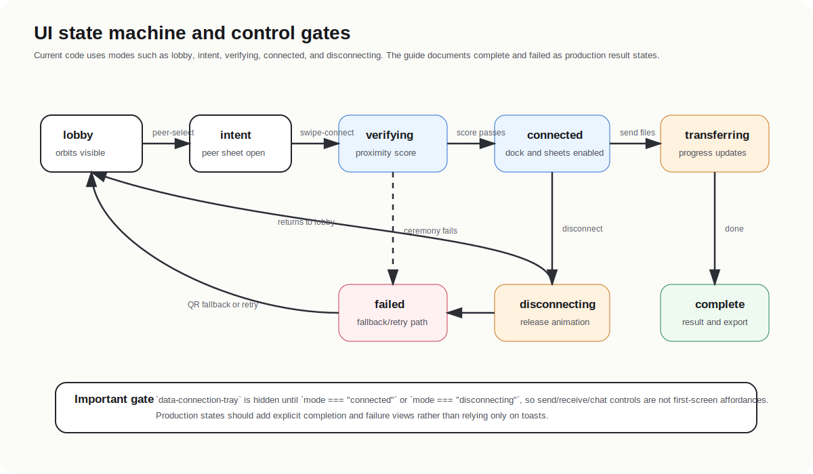

The current user path is:

1. Open app in `lobby`.
2. Mock signaling emits peers.
3. User taps a peer.
4. Controller stores `selectedPeerId` and opens the peer sheet.
5. User swipes to connect.
6. Controller changes mode to `verifying`.
7. `ProximityEngine.runCeremony()` returns metrics and score.
8. Controller sends telemetry through signaling.
9. If score fails, return to `lobby` and show QR fallback toast.
10. If score passes, `WebRtcTransport.preflight()` runs.
11. Controller changes mode to `connected`, stores `connectedPeerId`, path, and demo received PDF entries.
12. AppView renders the connected overlap and shows the dock.

The most important gate is in `AppView.renderTray()`:

```js
const connected = state.mode === "connected" || state.mode === "disconnecting";
this.nodes.tray.hidden = !connected;
this.nodes.connectedPeer.hidden = !connected;
```

That means the transfer dock is only visible after connection. The screenshot below is the connected state:

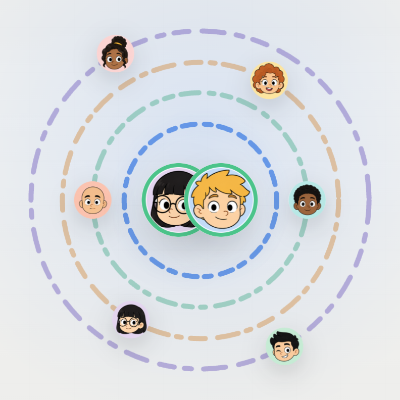

The connected dock appears only in this state:

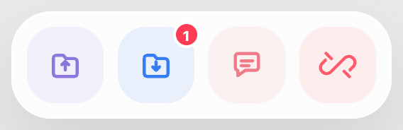

### Lobby

The lobby is the default discovery surface. It shows the local identity, orbit rings, candidate peers, settings, theme, and device name. The send/receive controls are hidden.

### Intent

Intent begins when the user selects a peer. In the mock flow, `inviteAccepted` also sets `mode: "intent"` and opens the peer sheet. The peer sheet keeps the product interaction explicit: "Swipe to connect" before trust and transport begin.

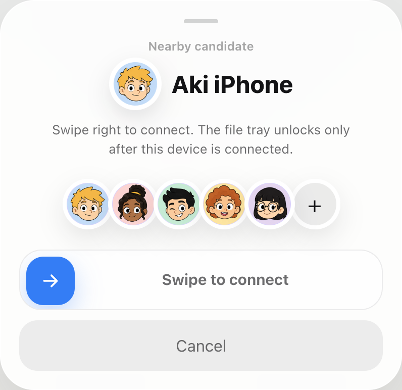

### Verifying

The verifying state runs the proximity ceremony. In the current prototype this is a timed score based on capabilities. In production, it should include one or more real evidence paths: QR token exchange, acoustic nonce, motion correlation, explicit acceptance, low-latency hints, and server-issued session freshness.

### Connected

Connected means the app has passed proximity verification and transport preflight. The UI changes to an overlapping two-avatar center, and the dock appears. Files can now be chosen, received files can be opened, chat can be used, and disconnect is available.

### Disconnecting

Disconnecting is a release animation state. The controller closes sheets, waits briefly, asks signaling to disconnect the peer, and resets transfer, files, path, received items, and chat.

<div class="page-break" style="page-break-after: always;"></div>

## 6. Orbit Interaction and Motion Design

The orbit is a product metaphor and a state surface. It is not just decoration. `css/orbit.css` establishes an orbit scene with a responsive `--orbit-size`, four SVG rings, and peer nodes positioned by angle and radius.

The local avatar is centered:

```css
.identity-core {
  position: absolute;
  z-index: 7;
  left: 50%;
  top: 50%;
  transform: translate(-50%, -50%);
}
```

Peer nodes use transform composition:

```css
transform:
  translate(-50%, -50%)
  rotate(var(--angle))
  translateY(calc(var(--radius) * -1))
  rotate(calc(var(--angle) * -1));
```

This keeps avatars upright while placing them on rings. `AppView.renderPeers()` chooses either the peer's own `ringIndex` and `angle` or a connected-layout position when another peer is connected.

The connected layout is a calmer state: the selected peer is removed from the orbit list and rendered as an overlapping avatar next to the self avatar. This creates the Venn-style connected signal.

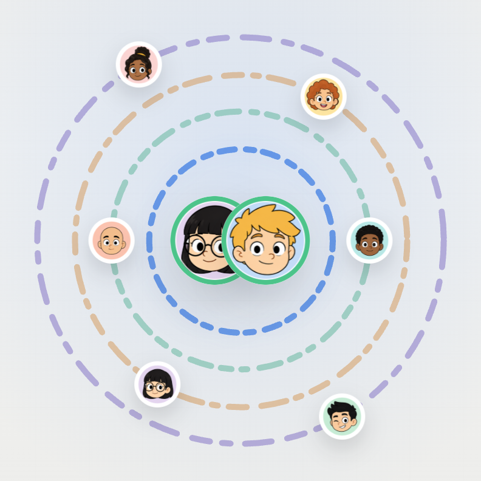

### Motion controls

The information sheet includes orbit motion controls. The current state key is `motionPaused`, stored in `localStorage` as `webdrop.motionPaused`. `AppView.render()` maps it to `data-motion`.

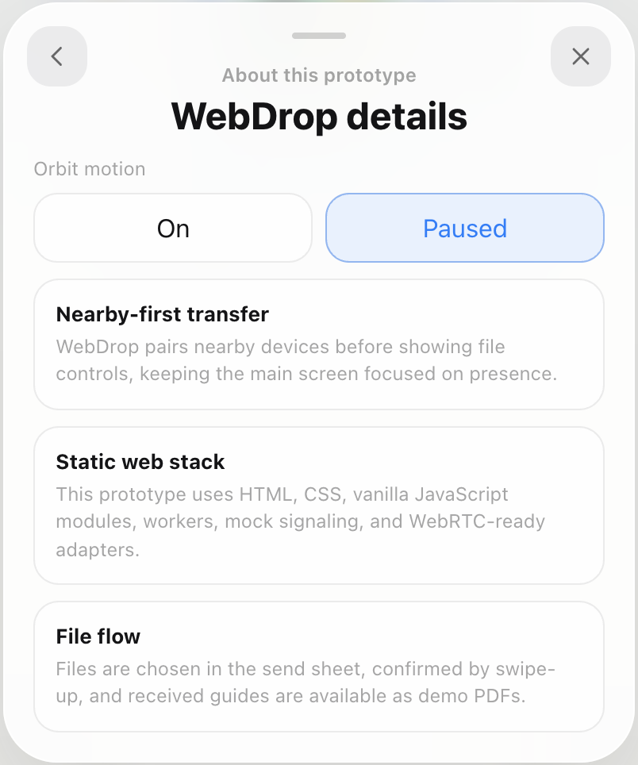

For production, motion policy should obey:

- `prefers-reduced-motion`.
- User-selected paused motion.
- Lower animation intensity during active transfer.
- No layout drift for the local self avatar.
- No peer label overlap in small viewports.

### Interaction rules

- A peer tap opens the peer sheet unless already connected to another peer.
- If connected to a peer and the user taps another peer, the controller warns that the current connection must be disconnected first.
- If connected to the same peer, the controller displays an already-connected message.
- The dock is not a discovery shortcut. It is a connected-state tool surface.

<div class="page-break" style="page-break-after: always;"></div>

## 7. Settings, Localization, and Visual Identity

Settings are part of the technical architecture because they shape persistent local identity. `js/app.js` initializes self identity from `localStorage`:

- `webdrop.deviceName`
- `webdrop.avatarChoice`
- `webdrop.ringColor`
- `webdrop.theme`
- `webdrop.locale`
- `webdrop.motionPaused`

The settings sheet lets users change profile icon, ring color, device name, language, and app information access.

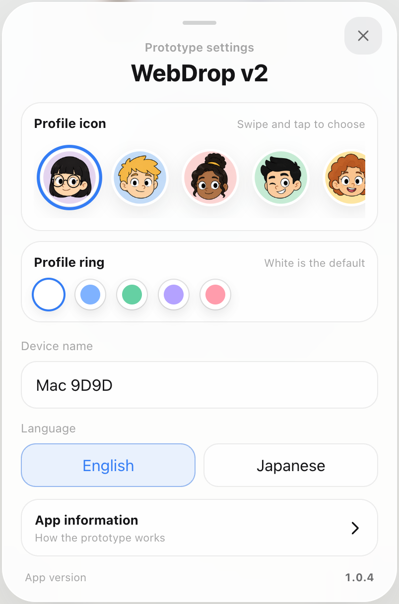

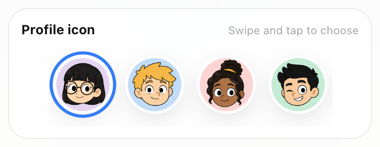

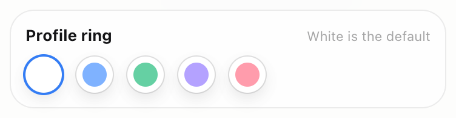

The Japanese screenshots demonstrate that the same sheet contract supports localization:

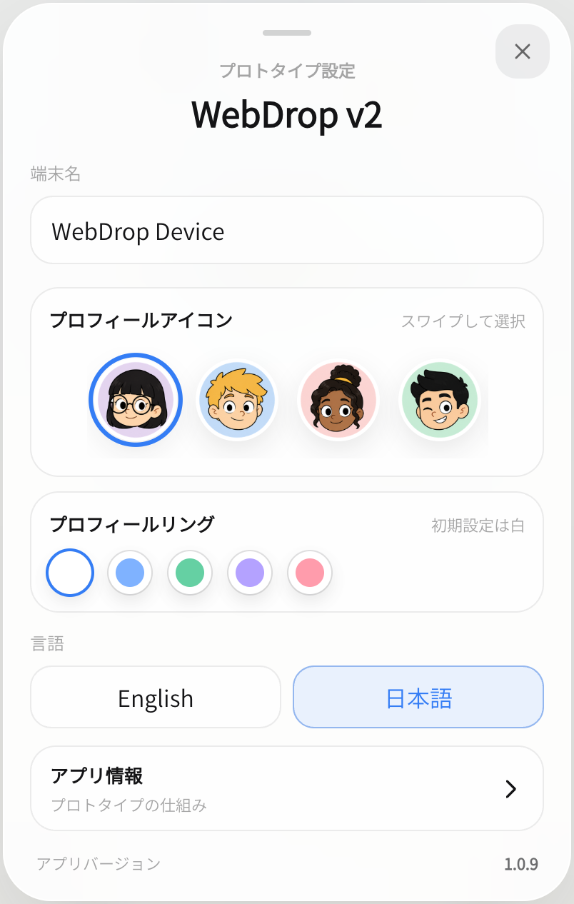

### Localization flow

`browserLocale()` in `js/app.js` checks stored locale first. If none is present, it inspects `navigator.languages` and accepts English or Japanese. `AppView.renderLocale()` updates:

- Text nodes marked with `data-i18n`.
- ARIA labels marked with `data-i18n-aria`.
- Placeholders marked with `data-i18n-placeholder`.
- Selected language button state.
- Selected motion button state.

The app's language control:

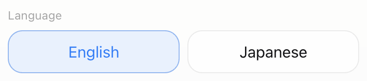

Production localization should keep all transport errors and permission messages in the i18n table. A transfer app's most important messages often appear under stress: permission denied, peer disconnected, storage full, relay cap exceeded, and retry available. Those need the same localization quality as the happy-path labels.

### Device identity

The device name is a local label, not a verified account identity. Production signaling should treat it as display text, validate length, sanitize it server-side, and avoid using it as an authorization key. Device identity for pairing should be session-token based.

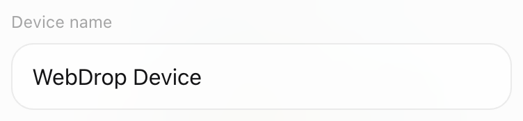

<div class="page-break" style="page-break-after: always;"></div>

## 8. Invite and Verification Flow

The current invite/verification path is implemented mostly in `js/core/controller.js`.

When a user selects a peer:

```js
store.patch({ selectedPeerId: peerId });
view.openPeerSheet(peer, { peers: store.getState().peers });
```

When the user swipes to connect:

```js
store.patch({ mode: "verifying", pendingInviteId: activePeerId });
const result = await proximity.runCeremony({ peer, capabilities: store.getState().capabilities });
await signaling.sendProximityTelemetry(activePeerId, result.metrics);
```

If verification fails, the app returns to lobby and shows a QR fallback toast. If verification passes, the transport preflight runs and the app enters connected mode.

### Current proximity scoring

`js/services/proximity-engine.js` uses a simple weighted score:

| Metric | Current source | Points |
| --- | --- | --- |
| `tokenFresh` | Always true in prototype | 24 |
| `acoustic` | Browser microphone capability | 30 |
| `tilt` | Browser motion capability | 12 |
| `bump` | Same as motion capability | 14 |
| `lowRttHint` | Always true in prototype | 6 |
| `qrFallback` | True when mic or motion missing | 30 |

The pass threshold is `58`.

This is a product scaffold. It is useful because it demonstrates how multiple evidence signals could become a single decision, but it should not be treated as security. In production, evidence must be bound to short-lived session tokens issued by the backend. A user should not be able to fake proximity by editing local capability values.

### Production ceremony model

A robust ceremony can combine several paths:

- QR code: receiver displays or scans a short-lived token.
- Acoustic nonce: one device plays a short encoded tone, the other listens and validates freshness.
- Motion correlation: both devices ask the user to perform a gesture and compare timing/shape.
- Explicit accept: receiver confirms the invite.
- Network hint: server observes coarse IP/network match, but this must never be sufficient alone.
- WebRTC path hint: low RTT and direct path can increase confidence after negotiation, but do not prove physical proximity.

QR should remain the universal fallback because it works when microphone permission, motion permission, audio playback, and autoplay policies fail.

<div class="page-break" style="page-break-after: always;"></div>

## 9. Signaling Boundary

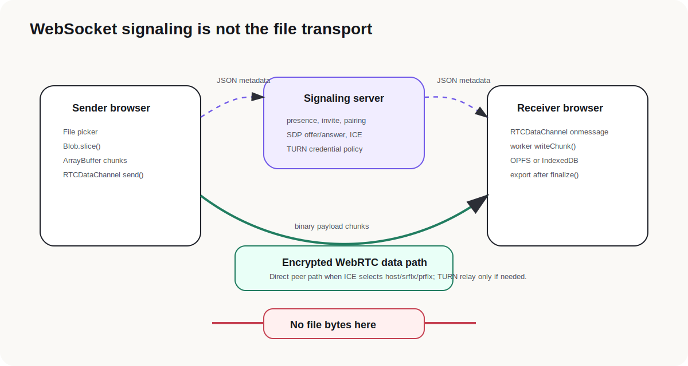

WebDrop has two signaling adapters:

- `MockSignalingAdapter` for the current prototype.
- `WebSocketSignalingAdapter` as the production boundary.

The mock adapter emits demo peers and accepts invite-style method calls. It makes the UI useful without a server. The WebSocket adapter is intentionally unconfigured:

```js
if (!this.url) {
  this.emit("unconfigured", {
    reason: "Production WSS endpoint is intentionally not built in this repo."
  });
  return;
}
```

That is a healthy boundary. The static client can define the message shapes, but production signaling needs server-side origin validation, session management, rate limits, TURN credential minting, and abuse controls.

### Metadata that belongs on signaling

The signaling channel should carry small JSON messages such as:

- `client:hello`
- presence update
- peer availability
- invite request
- invite accept/reject
- pairing session id
- proximity telemetry summary
- SDP offer
- SDP answer
- ICE candidates
- disconnect notice
- TURN credential request/response metadata

### Payload that must not go over signaling

File contents should not be sent over WebSocket signaling. This is a central architecture invariant.

Reasons:

- WebSocket file relaying turns the signaling server into a bandwidth-heavy file server.
- It increases hosting cost and abuse exposure.
- It complicates retention, privacy, and compliance.
- It removes the main benefit of WebRTC direct transport.
- It makes transfer performance dependent on server geography.

The only exception would be a deliberately separate product mode such as cloud relay or offline mailbox, and that would need its own storage, retention, encryption, and policy design. It should not be hidden inside the signaling adapter.

### Server-side validation

The production signaling server should:

- Reject binary WebSocket frames.
- Cap JSON message size.
- Validate message type and schema.
- Authenticate or rate-limit anonymous sessions.
- Bind pairing tokens to a short expiry.
- Validate allowed origins.
- Keep SDP and ICE messages scoped to a pairing session.
- Avoid logging sensitive SDP bodies unless redacted.
- Mint ephemeral TURN credentials rather than shipping static secrets to the browser.

<div class="page-break" style="page-break-after: always;"></div>

## 10. WebRTC Overview

WebRTC is a browser technology for real-time peer-to-peer communication. WebDrop needs the data part of WebRTC, not necessarily camera or microphone media streams. The key object is `RTCPeerConnection`.

An `RTCPeerConnection` does several jobs:

1. Describes local capabilities and desired channels.
2. Creates SDP offers and answers.
3. Gathers ICE candidates.
4. Tests network paths between peers.
5. Selects a candidate pair.
6. Establishes encrypted transport.
7. Hosts media tracks or data channels.

In WebDrop, the target payload lane is an `RTCDataChannel`.

### Current repository implementation

`js/services/webrtc-transport.js` currently does this in `preflight()`:

```js
const iceServers = await this.turnConfig.getIceServers();
this.peerConnection = new RTCPeerConnection({ iceServers });
this.channel = this.peerConnection.createDataChannel("binary_stream", { ordered: true });
```

The method waits briefly and returns a path guess. If `RTCPeerConnection` is missing, it returns `"failed"`. If the browser reports a cellular connection, it returns `"relay"`, otherwise `"direct"`.

This is not a complete WebRTC negotiation. It does not yet create and send SDP offers, receive answers, exchange ICE candidates, wait for `iceConnectionState`, or listen for remote channels. The guide and roadmap treat this as the scaffold for those steps.

### Production WebRTC sequence

For a real sender-initiated transfer:

1. Sender creates `RTCPeerConnection` with STUN/TURN servers.
2. Sender creates an ordered `RTCDataChannel`.
3. Sender creates an SDP offer.
4. Sender sets local description.
5. Sender sends offer through WebSocket signaling.
6. Receiver creates its `RTCPeerConnection`.
7. Receiver sets remote description from offer.
8. Receiver listens for the data channel.
9. Receiver creates answer and sets local description.
10. Receiver sends answer through signaling.
11. Both sides exchange ICE candidates through signaling.
12. ICE selects a candidate pair.
13. Data channel opens.
14. Transfer metadata is exchanged.
15. File chunks begin.

WebRTC uses DTLS/SCTP for data channels. That gives encryption and reliable ordered delivery options. WebDrop should still implement application-level metadata, checksums, progress, and cancellation, because encrypted transport does not by itself define file boundaries.

<div class="page-break" style="page-break-after: always;"></div>

## 11. RTCDataChannel, Blob, ArrayBuffer, and Chunks

An `RTCDataChannel` is a message-based data pipe between peers. It can send strings, `Blob`s, `ArrayBuffer`s, and typed array views. For file transfer, the most controlled approach is to send binary chunks with clear metadata.

### File and Blob

In the browser, selected files are `File` objects. A `File` is a specialized `Blob` with a name, type, and last-modified metadata. A `Blob` is an immutable byte range. It may represent bytes on disk or bytes held by the browser.

`TransferEngine.send()` uses:

```js
const chunk = file.slice(offset, offset + chunkSize);
await chunk.arrayBuffer();
```

`file.slice()` returns a new `Blob` view over the requested range. `chunk.arrayBuffer()` reads that range into memory. The current code does not send it through `WebRtcTransport.sendChunk()` yet; it reads the chunk to simulate work and progress.

### ArrayBuffer

An `ArrayBuffer` is a raw binary memory buffer. It is the natural form for a data-channel file chunk because it has a known byte length and can be transferred to a worker if needed.

Production WebDrop should send either:

- Binary `ArrayBuffer` messages on a file data channel, with metadata on a control channel.
- Binary payload envelopes that include a small header plus payload.

The first option is usually cleaner: keep control and data separate.

### Chunk size

The prototype uses `64 * 1024`, or 64 KiB, chunks. That is a reasonable starting point. Larger chunks reduce overhead but can increase buffering and latency. Smaller chunks make progress smoother but increase message count.

Production chunk size should adapt to:

- Data channel `bufferedAmount`.
- Device memory.
- Storage write speed.
- Relay/direct path.
- Mobile browser behavior.

### File manifest

Before sending chunks, the sender should send a manifest:

```json
{
  "type": "file:start",
  "transferId": "uuid",
  "fileId": "uuid",
  "name": "example.pdf",
  "mime": "application/pdf",
  "size": 1832044,
  "chunkSize": 65536,
  "chunkCount": 28,
  "hash": "sha-256-if-known"
}
```

Each chunk message should be attributable to a transfer and file:

```json
{
  "type": "file:chunk",
  "transferId": "uuid",
  "fileId": "uuid",
  "index": 7,
  "offset": 458752,
  "byteLength": 65536
}
```

If binary chunks are sent separately from control metadata, the receiver can infer order on an ordered channel but should still validate expected counts and sizes.

<div class="page-break" style="page-break-after: always;"></div>

## 12. Backpressure and Progress

Backpressure means the sender must slow down when the receiver, browser, network, or storage path cannot accept data fast enough.

Without backpressure, a transfer loop can enqueue too many chunks. That can cause memory growth, UI jank, data channel closure, or mobile browser crashes. WebDrop needs backpressure at three levels:

1. Browser send buffer.
2. Receiver storage queue.
3. Application-level acknowledgements.

### RTCDataChannel bufferedAmount

`RTCDataChannel.bufferedAmount` reports how many bytes are queued by the browser for sending. Production WebDrop should configure:

```js
channel.bufferedAmountLowThreshold = 1024 * 1024;
```

Then the sender can pause when `bufferedAmount` exceeds a high-water mark and resume when `bufferedamountlow` fires.

### Receiver acknowledgements

The receiver should send control messages such as:

- `file:ready`
- `chunk:ack`
- `chunk:nack`
- `storage:slow`
- `transfer:pause`
- `transfer:resume`
- `transfer:cancel`
- `file:complete`
- `file:verified`

The sender does not need an ACK for every chunk if the channel is reliable and ordered, but periodic acknowledgements are useful for progress, resume markers, and storage pressure.

### Progress semantics

The current prototype reports progress from bytes read:

```js
onProgress?.({
  name: file.name,
  sentBytes,
  totalBytes,
  ratio: totalBytes ? sentBytes / totalBytes : 1
});
```

Production progress should distinguish:

- Bytes read from local file.
- Bytes queued to data channel.
- Bytes acknowledged by receiver.
- Bytes written to receiver storage.
- Bytes finalized and verified.

User-facing progress should usually show receiver-acknowledged bytes, because that is closest to "the other device has it."

### Relay path caps

The controller currently enforces a 500 MiB cap when `path === "relay"`:

```js
const relayLimit = 500 * 1024 * 1024;
if (store.getState().path === "relay" && totalBytes > relayLimit) {
  view.toast(view.translate("relayLimit"));
  return;
}
```

That is the right product instinct. TURN relay bandwidth costs money and can be slower. The backend should return policy so the client can show the cap before the user selects a huge file.

<div class="page-break" style="page-break-after: always;"></div>

## 13. NAT, STUN, TURN, Relay Servers, and ICE

Most devices are behind NAT. NAT lets many devices share a public IP address and blocks unsolicited inbound traffic. That is good for practical networking, but it complicates direct peer-to-peer connections.

WebRTC solves this with ICE, which stands for Interactive Connectivity Establishment. ICE gathers possible connection candidates, tests them, and selects a working candidate pair.

### Candidate types

| Candidate type | Meaning | Direct or relay |
| --- | --- | --- |
| `host` | Local network address | Direct |
| `srflx` | Server reflexive address discovered through STUN | Direct |
| `prflx` | Peer reflexive address discovered during checks | Direct |
| `relay` | TURN relay address | Relay |

### STUN

STUN helps a browser discover how it appears from the public internet. The current `TurnConfigProvider.getIceServers()` returns:

```js
[{ urls: "stun:stun.l.google.com:19302" }]
```

That is useful for prototypes, but production should use an owned or managed STUN/TURN provider. Free public STUN should not be the only operational dependency.

### TURN

TURN is a relay system. When a direct route fails, both browsers send data to the TURN server, and the TURN server relays packets between them. TURN is essential for reliability because some NAT/firewall combinations block direct peer-to-peer paths.

TURN is also expensive because relay traffic consumes server bandwidth. WebDrop should:

- Use TURN only after direct ICE paths fail or when policy requires relay.
- Use ephemeral credentials minted by the backend.
- Apply file-size caps in relay mode.
- Show relay mode to users.
- Record aggregate relay metrics for cost and reliability planning.

### ICE candidate-pair stats

After connection, `RTCPeerConnection.getStats()` can reveal the selected candidate pair. The current `classifyPathFromStats()` checks local candidates and returns `"relay"` if it sees a relay candidate, or `"direct"` for host, server-reflexive, or peer-reflexive.

Production code should inspect the selected candidate pair more precisely:

- Find the transport report.
- Follow `selectedCandidatePairId`.
- Read local and remote candidate reports.
- Check candidate types.
- Track RTT, available outgoing bitrate, bytes sent, bytes received, and state.

The UI does not need to expose all of this, but the transfer engine needs enough information to choose chunk size, relay caps, and retry policy.

<div class="page-break" style="page-break-after: always;"></div>

## 14. End-to-End Transfer Flow

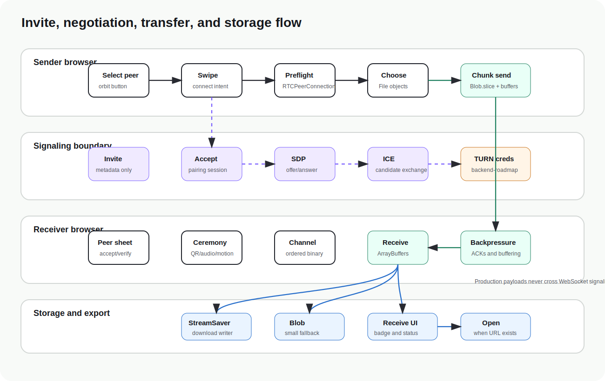

The complete production flow has three lanes: UI trust, signaling negotiation, and data transfer.

### Current prototype flow

1. Mock peers appear.
2. User opens connect sheet.
3. User swipes to connect.
4. Proximity score passes.
5. WebRTC preflight creates a local peer connection and data channel.
6. Connected state appears.
7. User chooses files.
8. Transfer engine reads files in 64 KiB slices and reports progress.
9. UI appends selected files to the receive list as a local demo.

The current code is excellent for UI and architecture validation, but it does not yet move real bytes between two browser sessions.

### Production send flow

1. Sender and receiver join signaling.
2. Sender invites receiver.
3. Receiver accepts.
4. Both sides run proximity ceremony bound to a pairing id.
5. Sender asks backend for ICE configuration and relay policy.
6. Sender creates `RTCPeerConnection`.
7. Sender creates control and file data channels.
8. Sender sends offer through signaling.
9. Receiver sends answer through signaling.
10. Both exchange ICE candidates.
11. Data channels open.
12. Sender sends transfer manifest.
13. Receiver checks storage quota and accepts or rejects.
14. Sender streams chunks while respecting backpressure.
15. Receiver writes chunks to OPFS or IndexedDB.
16. Receiver verifies byte count and hash.
17. Receiver finalizes and exposes export/open action.
18. Both sides show complete state.

### Production receive flow

The receiver must not wait until the whole file is available. On manifest:

1. Check file size and policy.
2. Estimate available storage.
3. Open OPFS or IndexedDB target.
4. Reply `file:ready`.
5. For each chunk, enqueue worker write.
6. Periodically ACK durable progress.
7. On final chunk, verify total bytes.
8. Compute or finalize hash.
9. Create a downloadable/exportable result.

The user should see a clear difference between "incoming file request," "receiving," "verifying," and "ready to open."

<div class="page-break" style="page-break-after: always;"></div>

## 15. Receive Storage Flow

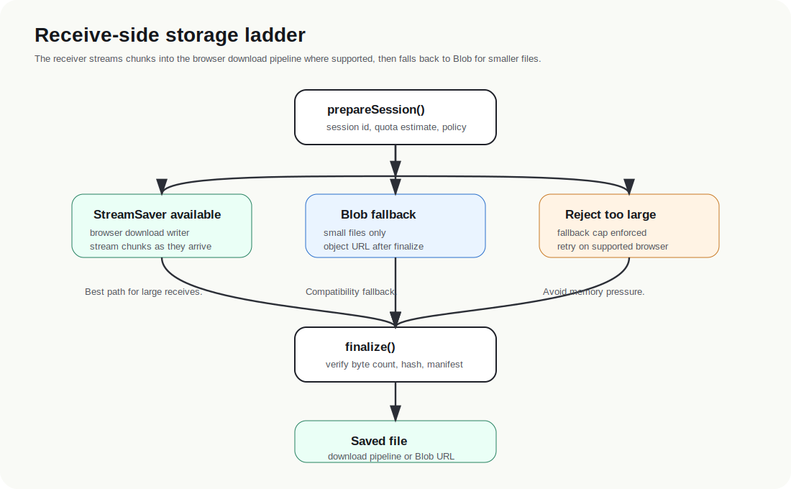

The receive side is the highest-risk part for large files. The sender can read from a user-selected file without loading the entire file into memory. The receiver must avoid accidentally assembling a multi-gigabyte file in RAM.

The current `StorageClient` wraps a worker in a promise-based request/response API. It sends:

- `prepare`
- `write`
- `finalize`

The current worker detects a backend:

```js
if (navigator.storage?.getDirectory) return "opfs";
if ("indexedDB" in self) return "indexeddb";
return "memory";
```

But it currently stores chunks in an array:

```js
let chunks = [];
chunks.push(payload);
```

That means the current storage worker is a scaffold. It detects the intended backend but does not yet write chunks to OPFS or IndexedDB.

### OPFS

OPFS means Origin Private File System. It is browser storage scoped to the origin. It can support file-like writing from a worker. For WebDrop, OPFS is the best target for large received files because it can write incrementally without building one giant `Blob`.

Production OPFS flow:

1. Worker receives `prepare`.
2. Worker calls `navigator.storage.getDirectory()`.
3. Worker creates or opens a transfer directory.
4. Worker creates a file handle for each incoming file.
5. Worker creates a writable stream.
6. Worker writes chunks by order.
7. Worker closes stream on finalize.
8. Worker returns a manifest and export handle metadata.

### IndexedDB

IndexedDB is the broad fallback. It can store chunks as records keyed by transfer id, file id, and chunk index. It is more awkward than a file writer, but it works across more browsers.

Production IndexedDB flow:

1. Open database `webdrop-transfers`.
2. Store session metadata.
3. Store each chunk as a record.
4. Track durable received byte count.
5. On finalize, read records in order and create export stream or `Blob`.
6. Clean up after export or expiry.

### Memory

Memory should be the last fallback. It is acceptable for small files and demos. It is risky for large files because the receiver has to hold many bytes at once. Production WebDrop should set a small memory-only cap.

<div class="page-break" style="page-break-after: always;"></div>

## 16. Workers and Main-Thread Safety

Workers keep expensive transfer and storage work away from the UI thread. The current repository already creates the storage worker from `js/app.js`:

```js
const storage = new StorageClient(
  new Worker("workers/storage-worker.js", { type: "module" })
);
```

That is the right boundary. The main thread should own UI state and user gestures. The worker should own receive persistence, hashing, and cleanup.

### Message design

The current worker protocol uses `{ id, type, payload }` messages and replies with `{ id, ok, payload, error }`. This is a good shape because `StorageClient` can map each request to a promise.

Production worker commands should include:

- `prepareSession`
- `prepareFile`
- `writeChunk`
- `flush`
- `finalizeFile`
- `abortTransfer`
- `readForExport`
- `deleteSession`
- `estimateQuota`

### Transferable objects

When sending `ArrayBuffer`s from the main thread to a worker, production code should use transfer lists where appropriate:

```js
worker.postMessage({ id, type: "writeChunk", payload }, [payload.buffer]);
```

Transfer lists move ownership of the buffer instead of copying it. That can reduce memory pressure. The code must be careful not to reuse a buffer after transferring it.

### Hashing

The browser's Web Crypto API supports one-shot digest operations, but very large files need incremental hashing. Production options:

- Use a streaming/incremental hash library inside the worker.
- Hash chunks as they arrive and finalize at the end.
- Use Web Crypto for per-chunk verification and a manifest-level hash where possible.

For a user-facing transfer, byte count verification is mandatory. Cryptographic hash verification is strongly recommended.

### UI responsiveness

The main thread should avoid:

- Reading huge chunks too quickly.
- Building huge arrays of chunk references.
- Rendering progress on every single chunk.
- Creating object URLs without revoking them.

Progress updates should be throttled, and rendering should reflect meaningful changes.

<div class="page-break" style="page-break-after: always;"></div>

## 17. Send, Receive, and Chat Sheets

The connected dock exposes four actions:

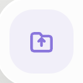
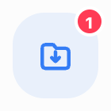


### Send sheet

The send sheet starts with no selected files:

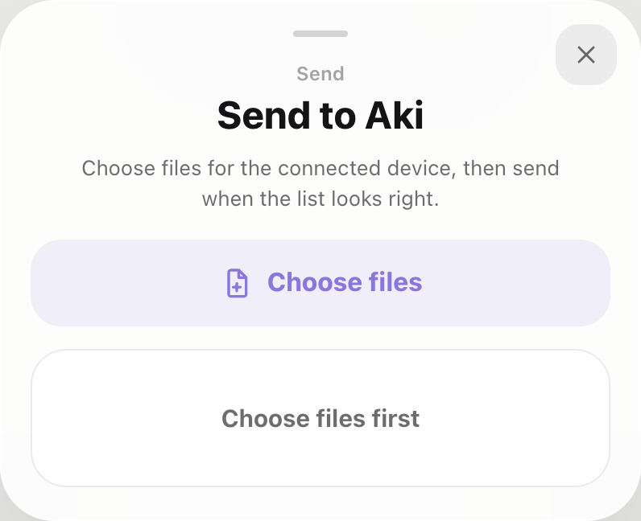

After selection, `AppView.renderFiles()` renders the selected file list and marks the vertical swipe control ready:

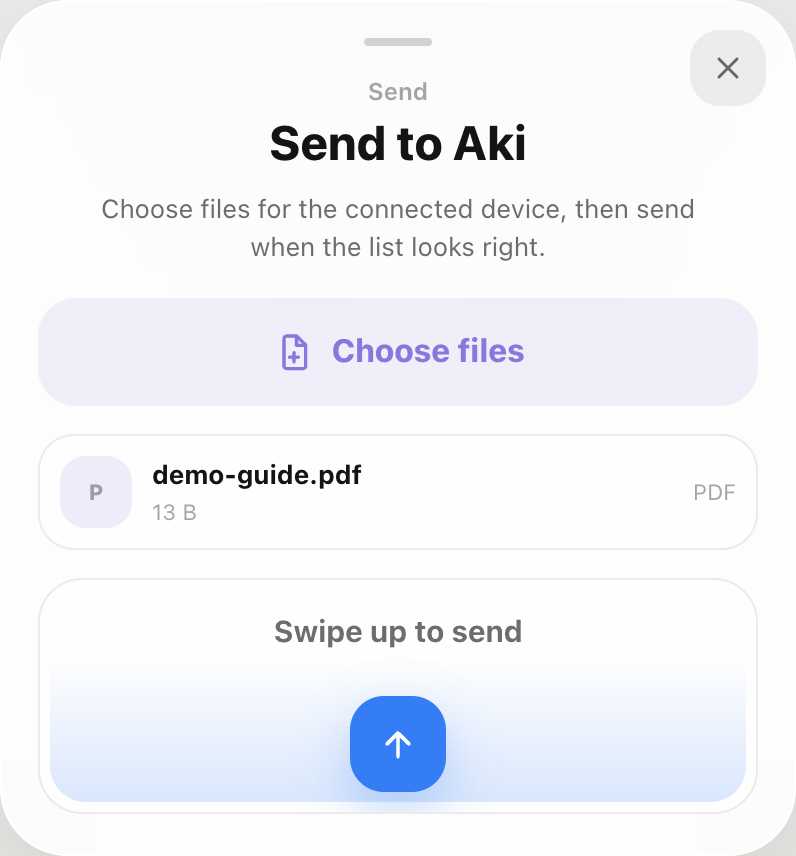

The send action can be triggered by the button event or the swipe-up event. In both cases, `sendSelectedFiles()` checks for a connected peer and selected files before calling `transfer.send()`.

Production send UX should add:

- Per-file progress.
- Total progress.
- Pause/cancel.
- Relay warning if path is relay.
- Receiver storage rejection message.
- Transfer complete receipt.

### Receive sheet

The current receive sheet lists demo PDFs after connection:

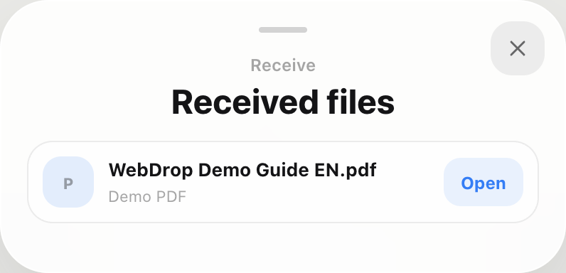

Production receive entries should be backed by real worker storage metadata. Each entry should know whether it is pending, receiving, verifying, ready, failed, expired, or deleted.

### Chat sheet

The current chat sheet is a local mock conversation:

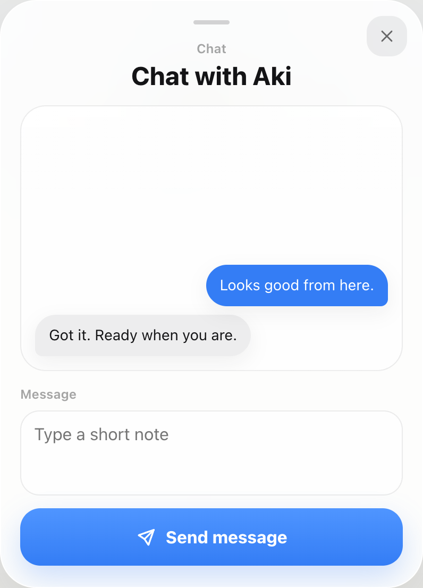

Chat is useful as a connected-peer affordance, but production chat should not distract from transfer reliability. If implemented over WebRTC, chat messages can use a control data channel. If implemented over signaling, they should be small text metadata and still scoped to the pairing session.

<div class="page-break" style="page-break-after: always;"></div>

## 18. Capability Detection and Permission Boundaries

`detectCapabilities()` checks:

- Secure context.
- Microphone API availability.
- Device motion API availability.
- Device motion permission API availability.
- WebRTC support.
- OPFS support.
- IndexedDB support.
- Worker support.
- WebSocket support.

The secure-context check is critical. Microphone, motion, service workers, and modern storage features are constrained by browser security policy. Localhost is a special case for development; production must be HTTPS.

### Permission reality

Capability availability is not the same as permission granted. A browser may expose `navigator.mediaDevices.getUserMedia`, but the user can deny microphone access. iOS motion APIs may require a user gesture and explicit permission call. Audio playback can be blocked by autoplay policy until the user interacts.

Production code should represent at least three states:

- Unsupported.
- Supported but not requested.
- Granted or denied.

That distinction matters for fallback UX. "Your browser cannot do this" is different from "Tap to allow microphone" and different again from "Microphone was denied, use QR."

### Current capability-to-proximity shortcut

The prototype uses capabilities directly as proximity metrics. For example, microphone support sets `acoustic: true`, and motion support sets `tilt` and `bump`. This is appropriate for a UI prototype but not sufficient for real trust.

Production evidence must be measured:

- Acoustic means a received nonce matched what the peer played.
- Motion means both devices produced correlated readings during the same token window.
- QR means the scanned token matched the session.
- Low RTT means a measured path quality value, not a hard-coded true.

### Fallback policy

Fallbacks should be treated as first-class paths:

- No microphone: QR.
- No motion: QR or explicit accept.
- No WebRTC: explain unsupported browser or offer cloud relay only if product policy allows.
- No OPFS: IndexedDB.
- No IndexedDB: memory only under small cap.
- No Worker: reject large receives or use very small in-memory mode.

<div class="page-break" style="page-break-after: always;"></div>

## 19. Security and Privacy Boundaries

WebDrop is a file-transfer application, so trust boundaries matter even in a prototype.

### What the client can trust

The client can trust direct user gestures in the current tab: tapping a peer, swiping to connect, choosing files, and confirming send. It can trust browser-provided file handles only for the files the user selected. It can trust the secure-origin constraint for APIs that require HTTPS.

The client should not trust:

- Device display names.
- Peer-provided file names.
- Peer-provided MIME types.
- Proximity metrics without server-issued session binding.
- Any SDP or ICE content outside the expected pairing session.
- Any message type not in the schema.

### File name safety

Received file names should be treated as display text. They should be escaped in HTML, sanitized for download, and never used to create arbitrary paths inside OPFS or IndexedDB. The current UI uses `escapeHtml()` before rendering selected and received file names, which is a good pattern.

### Payload privacy

With WebRTC data channels, file chunks are encrypted in transit by the WebRTC stack. That does not mean the app has end-to-end application-layer encryption independent of the browser session. If WebDrop wants stronger guarantees, the roadmap should add optional file encryption using keys exchanged through a verified pairing ceremony.

### Signaling privacy

Signaling metadata can still be sensitive. It may include device names, session ids, IP-derived candidate details, and timing. Production logging should be minimal and redacted. Retention should be short.

### Abuse controls

Production backend should prevent:

- Invite spam.
- Large message floods.
- TURN credential scraping.
- Cross-origin misuse.
- Pairing token brute force.
- Unbounded session creation.

Rate limits should be based on IP, origin, session, and account/device if accounts are later introduced.

<div class="page-break" style="page-break-after: always;"></div>

## 20. Backend Roadmap

The static repository is intentionally not a backend implementation. The production backend should be small but strict.

### Minimum production services

1. WebSocket signaling service.
2. Pairing session service.
3. TURN credential minting endpoint.
4. Presence registry with expiry.
5. Rate limiting and abuse controls.
6. Metrics pipeline.
7. Static asset hosting.

### Signaling service

Responsibilities:

- Accept secure WebSocket connections from allowed origins.
- Assign ephemeral client/session ids.
- Broadcast presence only within an appropriate discovery scope.
- Route invite, accept, SDP, ICE, telemetry, and disconnect messages.
- Reject binary frames and oversized JSON.
- Validate all message schemas.
- Expire idle sessions.

Non-responsibilities:

- Storing files.
- Relaying file chunks through WebSocket.
- Keeping long-term transfer history.

### TURN provider

The backend should mint ephemeral TURN credentials. Browser clients should never contain long-lived TURN secrets. Recommended policy shape:

```json
{
  "iceServers": [
    { "urls": "stun:stun.example.com" },
    {
      "urls": ["turns:turn.example.com:5349"],
      "username": "session-expiring-user",
      "credential": "short-lived-credential"
    }
  ],
  "relayLimitBytes": 524288000,
  "expiresAt": "2026-06-15T12:00:00Z"
}
```

### Observability

Track aggregate metrics without file contents:

- Invite count.
- Verification pass/fail by method.
- WebRTC connection success/failure.
- Direct versus relay path ratio.
- Average connection setup time.
- Transfer size buckets.
- Transfer completion/failure.
- Storage backend chosen.
- Browser family and platform.

These metrics tell the team whether the product is actually reliable across real networks.

<div class="page-break" style="page-break-after: always;"></div>

## 21. Current Limitations

The current app is a polished static prototype, not yet a production transfer system.

### Implemented today

- Mobile-first static app shell.
- Orbit lobby with centered self avatar.
- Mock nearby peers.
- Peer selection and swipe-to-connect sheet.
- Capability detection.
- Prototype proximity score.
- WebRTC preflight scaffold.
- Connected-state dock gating.
- File picker and selected file rendering.
- Simulated chunk progress over selected files.
- Demo received PDF entries.
- Settings, theme, profile icon, ring color, language, motion preference.
- Storage worker scaffold with backend detection.
- Service worker static cache outside localhost.

### Not implemented yet

- Real WebSocket signaling endpoint.
- Real SDP offer/answer exchange.
- Real ICE candidate exchange.
- Real remote peer connection.
- Real `RTCDataChannel` file payload send/receive.
- Receiver-side OPFS writer.
- Receiver-side IndexedDB chunk store.
- Incremental hashing.
- Resume support.
- Real QR/acoustic/motion verification.
- Production TURN credentials.
- Backend rate limits and schema validation.
- Transfer failure and retry screens.

### Documentation stance

This guide uses "should" for production behavior and "current" for implemented behavior. That distinction is intentional. Architecture documentation should help future implementers know what exists, what is only scaffolded, and what must not be overclaimed.

<div class="page-break" style="page-break-after: always;"></div>

## 22. Screenshot and Asset Index

The guide references existing screenshots from both English and Japanese capture directories.

### English UI screenshots

| Screenshot | Purpose |
| --- | --- |
| `output/screenshots/ui-elements-en/app-light.png` | Product overview, lobby |
| `output/screenshots/ui-elements-en/app-dark.png` | Dark-mode reference |
| `output/screenshots/ui-elements-en/orbit-with-peers.png` | Peer orbit rendering |
| `output/screenshots/ui-elements-en/connect-sheet.png` | Invite confirmation |
| `output/screenshots/ui-elements-en/orbit-connected.png` | Connected Venn state |
| `output/screenshots/ui-elements-en/dock-actions.png` | Connected dock |
| `output/screenshots/ui-elements-en/send-sheet-empty.png` | Send before file selection |
| `output/screenshots/ui-elements-en/send-sheet-selected.png` | Send with file selected |
| `output/screenshots/ui-elements-en/receive-sheet.png` | Received files |
| `output/screenshots/ui-elements-en/chat-sheet.png` | Chat sheet |
| `output/screenshots/ui-elements-en/settings-sheet.png` | Settings |
| `output/screenshots/ui-elements-en/app-information-sheet.png` | Information and motion controls |

### Japanese UI screenshots

| Screenshot | Purpose |
| --- | --- |
| `output/screenshots/ui-elements-ja/app-light.png` | Localized lobby |
| `output/screenshots/ui-elements-ja/orbit-connected.png` | Localized connected state |
| `output/screenshots/ui-elements-ja/settings-sheet.png` | Localized settings |
| `output/screenshots/ui-elements-ja/receive-sheet.png` | Localized received files |
| `output/screenshots/ui-elements-ja/send-sheet-selected.png` | Localized send sheet |

### New diagram assets

| Diagram | Source |
| --- | --- |
| System map | `assets/diagrams/webdrop-system-map.svg` |
| UI state machine | `assets/diagrams/webdrop-ui-state-machine.svg` |
| Transfer flow | `assets/diagrams/webdrop-transfer-flow.svg` |
| Storage ladder | `assets/diagrams/webdrop-storage-ladder.svg` |
| Signaling boundary | `assets/diagrams/webdrop-signaling-boundary.svg` |

All diagrams are SVG files committed as source assets. Mermaid is not required to render the production diagrams.

<div class="page-break" style="page-break-after: always;"></div>

## 23. Print and PDF Render Guidance

This Markdown file is intended to render as a long technical guide. A renderer should preserve local images, SVGs, tables, code blocks, and explicit page breaks.

Recommended print CSS:

```css
@page {
  size: Letter;
  margin: 0.65in;
}

body {
  font: 11pt/1.45 system-ui, -apple-system, BlinkMacSystemFont, "Segoe UI", sans-serif;
  color: #1b1c20;
}

h1, h2 {
  page-break-after: avoid;
}

img {
  max-width: 100%;
  height: auto;
  page-break-inside: avoid;
}

table, pre {
  page-break-inside: avoid;
}

.page-break {
  page-break-after: always;
  break-after: page;
}
```

Recommended renderer assumptions:

- Render from the repository root or preserve relative image paths from `docs/`.
- Allow local image loading.
- Keep SVG images enabled.
- Use a page size with enough width for tables and diagrams.
- Preserve code block wrapping or use smaller monospace text.

The document has more than 20 explicit print sections. If a renderer ignores page-break HTML, the image-heavy content and section count should still produce a long guide, but page count will vary by font size, page size, and image scaling.

### QA checklist for future render pass

- Confirm every image path resolves.
- Confirm SVG diagrams appear, not alt text only.
- Confirm English and Japanese screenshots render.
- Confirm no screenshot is cropped beyond readability.
- Confirm tables do not overflow page width.
- Confirm code blocks do not force horizontal clipping.
- Confirm final PDF has at least 20 pages.
- Confirm the guide does not claim real remote file transfer is implemented.

<div class="page-break" style="page-break-after: always;"></div>

## 24. Implementation Checklist

Use this checklist when turning the current prototype into production transfer behavior.

### Client transfer

- Add real offer/answer creation in `WebRtcTransport`.
- Route SDP and ICE through `WebSocketSignalingAdapter`.
- Add `ondatachannel` handling on receiver.
- Split control and file data channels or define a robust envelope format.
- Implement `bufferedAmount` backpressure.
- Add transfer manifests and file ids.
- Add receiver ACKs and cancel messages.
- Add per-file and total transfer progress.
- Add completion, failure, and retry states.

### Storage

- Replace worker chunk array with OPFS writes.
- Add IndexedDB chunk fallback.
- Enforce memory fallback size cap.
- Add quota estimate before accepting incoming files.
- Add byte-count verification.
- Add hash verification.
- Add export and cleanup.

### Backend

- Build WebSocket signaling endpoint.
- Validate all message schemas.
- Add origin and rate-limit policy.
- Add ephemeral pairing sessions.
- Add ephemeral TURN credentials.
- Add direct/relay path metrics.
- Add server-side observability without file payload logging.

### Product

- Keep send/receive controls hidden until verified connected.
- Keep QR as universal fallback.
- Show relay mode and relay caps.
- Localize all errors.
- Respect reduced motion.
- Keep self avatar centered across viewports.

WebDrop's architecture is strongest when it preserves its boundaries: trust before controls, signaling before WebRTC, metadata before payload, worker storage before export, and explicit user recovery when a browser or network path cannot satisfy the ideal flow.
