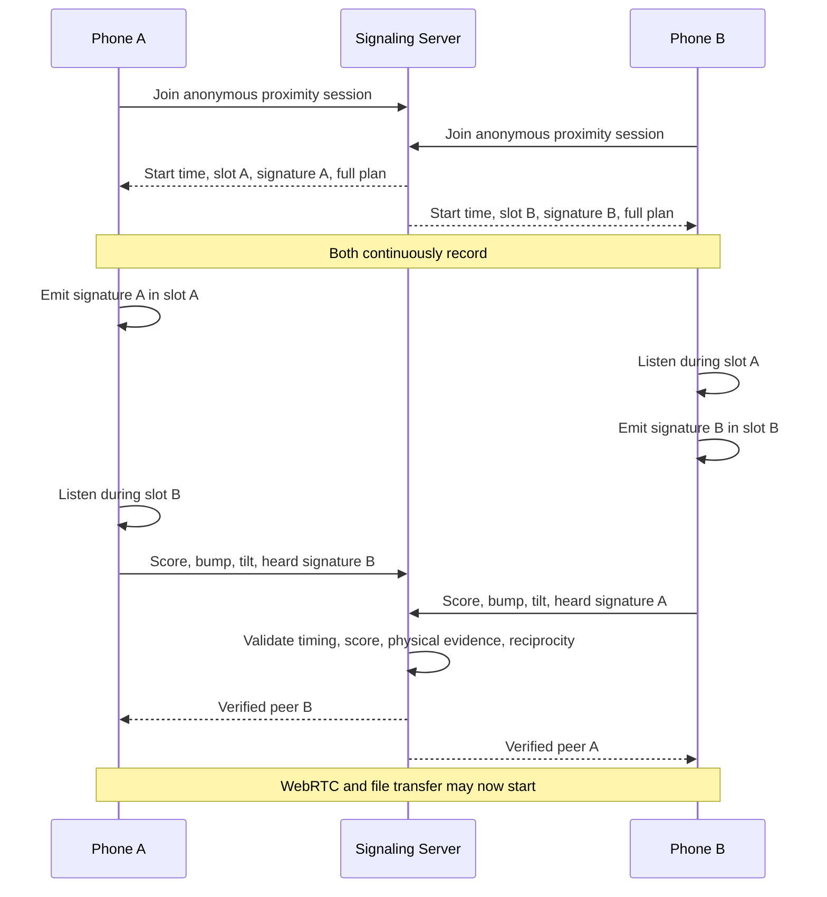

# WebDrop Physical Proximity, Scoring, and Ultrasonic Scheduling

## Purpose

This document explains how WebDrop decides that two nearby devices are the
intended pair. It covers the complete path from pressing **Connect** to opening
the file-transfer channel.

It is written at two levels:

1. A simple explanation that can be understood without networking knowledge.
2. The exact technical behavior currently implemented by WebDrop.

> Related reading: [`webdrop-concepts-revision-guide.md`](webdrop-concepts-revision-guide.md)
> explains TDMA, Aloha, ultrasonic chirps, and NAT/STUN/TURN from first
> principles and answers the multi-device pairing questions; this document is the
> precise scoring/scheduling reference.
> [`webdrop-app-documentation.md`](webdrop-app-documentation.md) shows how the
> whole app is built.

## The Short Version

Imagine six children standing in a room. Each child has:

- a private whistle sound,
- a numbered turn to whistle,
- a motion sensor that notices a bump,
- and a sensor that notices whether the phone was tilted.

A teacher acts as the coordinator.

The teacher says:

> "Everyone listen. Child A whistles first, Child B whistles second, and Child
> C whistles third."

Because everyone has a different turn, they do not all whistle over one
another. Every device listens through the whole exercise, but only transmits
during its own assigned time slot.

Afterward, two devices can say:

> "I heard your private whistle, you heard mine, and we both recorded a bump
> and a tilt at nearly the same time."

Only then does the server reveal their identities and connect them.

That is WebDrop's current **server-coordinated reservation TDMA** design.

## What Happens After Connect Is Pressed

### 1. Permissions are unlocked

The user's tap is used to request or activate:

- microphone input,
- audio output,
- device motion events.

iPhone browsers require these operations to originate from a real user gesture.
An administrator cannot remotely force an iPhone permission prompt.

The microphone stream is kept warm during the app session so repeated
ceremonies do not unnecessarily call `getUserMedia()` again.

### 2. The device joins an anonymous proximity session

The client sends the server:

- a random session nonce,
- its audio sample rate,
- whether the audio context is ready,
- whether microphone capture is ready.

No other person's name or avatar is selected at this stage.

### 3. The server briefly collects nearby participants into a bounded cohort

Current production values (`azure cloud server/.env.example`,
`azure cloud server/src/signaling-hub.js`):

| Setting | Env knob | Current value |
| --- | --- | ---: |
| Initial join window | `PROXIMITY_SESSION_JOIN_WINDOW_MS` | 1,800 ms |
| One-person extension | (built in) | One additional 1,800 ms window |
| Per-cohort device cap | `MAX_PROXIMITY_SESSION_CLIENTS` | 6 (clamped — see below) |
| Global participant cap | `MAX_TOTAL_PROXIMITY_PARTICIPANTS` | 100 |
| Delay before the ceremony starts | `PROXIMITY_SESSION_START_DELAY_MS` | 1,200 ms |
| Acoustic ceremony duration | `PROXIMITY_SESSION_DURATION_MS` | 3,600 ms |
| Server session lifetime | `PROXIMITY_SESSION_TTL_MS` | 15,000 ms |
| Allowed bump-time difference | `PROXIMITY_SESSION_MATCH_SLOP_MS` | 4,000 ms |

If only one phone joins after the extension, the normal pairing ceremony ends
with `no_nearby_partner`. This is correct for pairing, because one phone cannot
pair with itself.

The admin **single-device diagnostic mode** is different. It can test one
phone's speaker, microphone, bump sensor, and tilt sensor without creating a
pairing session.

### 3a. Many concurrent cohorts, not one global session

WebDrop no longer keeps a single open proximity session. The hub tracks a set
of open cohorts (`openProximitySessionIds`). When a phone joins:

1. If it is already inside an open (not-yet-started) cohort, it is
   re-acknowledged in place (idempotent re-join — it is not double-counted).
2. Otherwise, if the global participant count has reached
   `MAX_TOTAL_PROXIMITY_PARTICIPANTS` (default **100**), the join is rejected
   cleanly with `proximity:session:failed` and `reason: "capacity_reached"`.
3. Otherwise it is placed into any open cohort that still has room, or a fresh
   concurrent cohort is opened for it.
4. When a cohort reaches its per-cohort cap it is closed to new joiners (removed
   from the open set) and its ceremony starts shortly; the next joiner opens a
   new concurrent cohort.

**Why the per-cohort cap is clamped.** Every device in one cohort shares one
acoustic band and is separated by *time slots*. A single coded chirp needs about
`ACOUSTIC_MIN_SLOT_MS` (520 ms) plus an `ACOUSTIC_SLOT_GUARD_MS` (80 ms) guard,
so the slot floor is ~600 ms. Inside the 3,600 ms ceremony window only
`floor(3600 / 600) = 6` slots fit. The hub computes this `cohortCeiling` from the
ceremony window and **clamps** `MAX_PROXIMITY_SESSION_CLIENTS` to it, so a
misconfiguration can never schedule sub-floor slots. Raising the real per-cohort
size therefore requires extending `PROXIMITY_SESSION_DURATION_MS`, not just the
cap (`proximitySessionDurationMs: 4800` → ceiling 8, verified in
`tests/signaling-hub-proximity-scaling.test.mjs`).

So with the current defaults, 100 participants resolve to roughly
`100 / 6 ≈ 17` concurrent 6-person cohorts, i.e. up to ~50 simultaneous pairs.

**Cross-cohort de-confliction.** Concurrent cohorts that fill at the same instant
are spread across a few start-time phases (`ACOUSTIC_SESSION_STAGGER_MS`,
`ACOUSTIC_SESSION_STAGGER_PHASES`) so they do not all begin chirping at once. If
the usable hardware band is wide enough to fit more than one `>=`
`ACOUSTIC_MIN_BANDWIDTH_HZ` lane, concurrent cohorts are also pinned to different
acoustic sub-bands (`ACOUSTIC_MAX_CONCURRENT_SUBBANDS`, round-robin by creation
order). With the default 18.6–19.4 kHz band only one ≥420 Hz lane fits, so
sub-band splitting is a no-op until the band is widened. The cohort's assigned
lane is reported to clients as the additive `acousticBandIndex` /
`acousticBandCount` fields on `proximity:session:start`.

> **Honest reliability note (physical-device dependent).** The software *allows*
> ~50 co-located pairs, and time-slotting/staggering/sub-banding reduce
> contention, but ~50 pairs sharing one ~800 Hz ultrasonic band in one physical
> room is acoustically crowded. Whether that many pairs reliably hear each other
> is an empirical, hardware-and-room question that must be measured on real
> phones — it is not something the scheduler can guarantee. See "Path to 10,000"
> in `azure cloud server/README.md`.

## Why WebDrop Uses Reservation TDMA

TDMA means **Time Division Multiple Access**. The shared acoustic channel is
divided into time slots.

The word **reservation** means the server assigns those slots before any phone
transmits.

For three phones, a simplified schedule looks like this:

```text
Shared recording:  [---------------------------------------------]

Slot 1:             Phone A emits; Phones B and C listen
Slot 2:             Phone B emits; Phones A and C listen
Slot 3:             Phone C emits; Phones A and B listen
```

Every phone continuously records the complete ceremony. A phone only plays its
own coded chirp in its assigned slot. The recording is decoded after the
scheduled frame.

### Why this is not Slotted ALOHA

Slotted ALOHA also divides time into slots, but devices usually choose a slot
competitively or randomly. Two devices can choose the same slot and collide.
They then need a retry and random backoff.

WebDrop already has:

- a signaling server,
- a known set of session participants,
- synchronized start timestamps,
- and the ability to assign every participant a unique slot.

Therefore, deliberately assigning slots is more reliable than asking phones to
gamble on random slots.

### When Slotted ALOHA could still help

Framed Slotted ALOHA could be considered as a limited fallback when:

- the signaling coordinator is unavailable,
- devices cannot receive a slot assignment,
- or a future acoustic-only discovery mode is required.

It should not replace the coordinated production path for two to six known
participants.

## The Ultrasonic AudioChime

### Intended frequency band

The production target is currently:

```text
18.6 kHz to 19.4 kHz
```

The default chirp lasts approximately:

```text
112 ms
```

The app requests raw microphone processing:

- echo cancellation off,
- noise suppression off,
- automatic gain control off.

This reduces browser processing that could erase or distort high-frequency
energy.

The band is intended to be above normal adult hearing, but real speakers,
microphones, sample rates, harmonics, and individual hearing ranges vary.
WebDrop must therefore validate inaudibility and reliability on each supported
device family rather than claiming that every physical phone is identical.

### Sample-rate safety

The server examines participant sample rates and keeps the selected band below
a conservative portion of the lowest Nyquist limit.

The current shared-band rule uses approximately:

```text
safe maximum = sample rate x 0.45 - 100 Hz
```

The server requires at least 420 Hz of usable high-frequency bandwidth.

### Coded signatures

Every participant receives:

- a unique signature ID,
- a code number,
- a reserved slot,
- the shared frequency range.

The code and time slot help distinguish one phone from another even when they
use the same general frequency band.

### Continuous listening

The phones do not repeatedly switch the microphone on and off for each slot.
They record the entire frame, emit only during their own slot, and decode the
captured recording afterward.

This is important because mobile audio startup latency can be inconsistent.

## How Audio Detection Works

WebDrop evaluates more than "was there noise?"

### Correlation

Correlation measures how closely the recorded waveform matches the expected
coded chirp shape.

Main current thresholds:

| Detection method | Requirement |
| --- | ---: |
| Normal correlation | Correlation at least 0.30 |
| Slot-correlation fallback | Correlation at least 0.20 |
| Energy-assisted fallback | Correlation at least 0.16 and margin at least 4.5 dB |
| Slot-energy fallback | Energy margin at least 8 dB |

The decoder checks the assigned slot and an expanded window to tolerate mobile
audio timing drift.

### Energy margin

Energy margin compares energy inside the expected chirp region against nearby
background energy.

For example:

```text
Expected chirp band: -40 dB
Nearby noise:        -52 dB
Energy margin:        12 dB
```

A larger positive margin makes it more likely that a real transmission was
present.

### Reciprocal acoustic proof

It is not enough for Phone A to hear any ultrasound.

For A and B to match:

- A must report its own assigned signature correctly.
- B must report its own assigned signature correctly.
- A must identify B's signature.
- B must identify A's signature.
- Both detections must pass an accepted correlation or energy rule.
- The winning signature must be sufficiently clearer than competing signatures.

The current winner-confidence margin is `ACOUSTIC_WINNER_MARGIN = 0.04`
(`azure cloud server/src/signaling-hub.js`). This guard now **fails safe**: a
device that reports a missing or non-finite `acousticConfidenceMargin` *fails*
the winner-margin check rather than passing it by default
(`hasSufficientWinnerMargin`). Both ceremony paths in
`js/services/proximity-engine.js` (the per-slot listen path and the
continuous-capture decode path) compute and report a real confidence margin, so
the server always evaluates an actual separation value.

This reciprocal requirement helps prevent a third nearby phone from being
selected by mistake.

## Bump Detection

The bump detector uses two possible motion signals:

1. Linear acceleration magnitude.
2. A sudden change in the gravity-including acceleration vector.

Current sensor thresholds:

| Signal | Threshold |
| --- | ---: |
| Linear acceleration | 10 |
| Gravity-vector change | 3.5 |

A bump is accepted when either threshold is reached.

### Current bump score

For the present build (`BUMP_SCORE_POINTS = 20` in
`js/services/proximity-engine.js`, commit "Award twenty points for valid bumps"):

```text
Detected bump = 20 points
No bump       = 0 points
```

The complete connection threshold remains 55 points. A detected bump alone is
never sufficient: the server also requires explicit ultrasound, bump, and tilt
evidence (see "The Current Score" below).

The server also requires explicit bump evidence. A high total produced by
unrelated signals cannot silently replace the missing bump.

## Tilt Detection

Tilt is calculated from gravity acceleration.

The phone estimates two angles:

- beta,
- gamma.

Tilt passes when either absolute angle is **strictly greater than 30 degrees**.

```text
30.0 degrees = fail
30.1 degrees = pass
```

The server also requires explicit tilt evidence. Score alone cannot replace it.

## The Current Score

WebDrop currently has two representations of the same evidence:

1. The client produces a raw diagnostic point score.
2. The production server normalizes the configured weights into a percentage.

### Client diagnostic points

| Evidence | Maximum points |
| --- | ---: |
| Ultrasonic sound match | 34 |
| Combined motion correlation | 26 |
| Bump | 20 |
| Tilt | 12 |
| QR metric in the generic analyzer | 8 |
| Total | 100 |

The client-side point model has a maximum of 100. The client formula
(`proximityScore` in `js/services/proximity-engine.js`) is:

```text
score =
  sound x 34
  + motion correlation x 26
  + bump x 20
  + tilt x 12
  + QR x 8
```

Every input is normalized between 0 and 1.

### Server percentage

The server (`azure cloud server/src/proximity-score.js`) uses the same weights
expressed as fractions that sum to 1.0, then normalizes them (the sum is already
1.0, so the effective weights are unchanged):

| Evidence | Configured weight | Effective percentage weight |
| --- | ---: | ---: |
| Ultrasonic sound | 0.34 | 34% |
| Combined motion correlation | 0.26 | 26% |
| Bump | 0.20 | 20% |
| Tilt | 0.12 | 12% |
| QR metric | 0.08 | 8% |
| Total | 1.00 | 100% |

This is why complete physical evidence without QR is:

```text
92 raw client points
92% normalized server score
```

### Motion correlation

Current client behavior:

```text
Bump and tilt both detected = 1.0
Motion samples exist only   = 0.4
No motion samples           = 0.0
```

### Required threshold

```text
Minimum score = 55
```

The client requires at least 55 raw points before it considers its local
ceremony successful. The production server requires at least 55% after weight
normalization.

However, either form of 55 alone does not authorize a physical pairing.

For bump-mode pairing, the server requires all of the following:

1. Score is at least 55.
2. Ultrasound evidence is present.
3. Bump evidence is present.
4. Tilt evidence is present.
5. Ceremony timestamps are valid.
6. Both phones reciprocally recognize each other's signature.
7. The two bump timestamps are within the server's matching window.
8. The match is not ambiguous against another nearby phone.

## Worked Score Examples

### Example A: complete physical match

```text
Sound:             1.0 x 34 = 34
Motion correlation 1.0 x 26 = 26
Bump:              1.0 x 20 = 20
Tilt:              1.0 x 12 = 12
QR:                0.0 x  8 =  0
                                 --
Raw client total                 92
Normalized server score          92%
```

Both score forms pass their threshold, and all required physical signals are
present.

The server still verifies reciprocal signatures and timing before connecting.

### Example B: strong movement but no ultrasound

```text
Sound:             0
Motion correlation 26
Bump:              20
Tilt:              12
Total:             58
```

The raw score (58) is above 55, but this still **fails**: the server requires
mandatory ultrasound evidence, and `physicalEvidence.ultrasound` is false. Score
alone never authorizes a pairing.

### Example C: ultrasound and ordinary motion, but no bump or tilt

```text
Sound:             34
Motion samples:    0.4 x 26 = 10.4
Bump:              0
Tilt:              0
Total:             44.4
```

This fails.

### Example D: score seems high, but reciprocal identity is wrong

Phone A hears Phone C while Phone B hears Phone A.

Even if individual scores are high, A and B do not reciprocally identify one
another. The server rejects the pairing as ambiguous or nonreciprocal.

## Matching Multiple Devices

Suppose A, B, C, and D are in one room.

- A bumps with B.
- C bumps with D.
- Everyone hears some high-frequency energy.

The server does not simply choose the first name in the room.

It compares:

- which signature each phone was assigned,
- which signature each phone heard most strongly,
- whether recognition is reciprocal,
- bump timing,
- score,
- mandatory physical evidence.

The intended result is:

```text
A <-> B
C <-> D
```

not:

```text
A <-> C
B <-> D
```

## QR Fallback

QR is explicit and peerless:

1. One device creates a short-lived token.
2. The other device scans it.
3. The server verifies issuer, scanner, expiry, and replay status.
4. The server creates the pair.

QR does not automatically open after a failed physical score. The failure
screen remains visible until the user chooses:

- Retry,
- Use QR,
- Cancel.

## Single-Device Diagnostic Mode

The admin monitor is not a pairing ceremony.

It is designed to answer:

- Can this phone emit the configured chirp?
- Does its microphone observe energy in 18, 19, 20, and 21 kHz channels?
- What are the peak, noise, margin, confidence, and sample rate?
- Does the phone detect a physical bump?
- Does it report a tilt strictly above 30 degrees?

### Permission behavior

Pressing **Start monitoring** on the admin page arms the selected phone.

If microphone, speaker, and motion are already unlocked, monitoring begins
immediately.

If they are not unlocked, the selected phone asks the user to tap **Connect**
once. That local tap activates the browser permissions and automatically starts
diagnostic mode. It does not wait for another device and does not join a
proximity pairing session.

### Important limitation

A one-phone self-test proves that the selected phone attempted to emit and that
its own microphone observed the measured spectrum.

It does not prove that a second physical phone received and decoded the chirp.
Reciprocal acoustic proof still requires a real two-device ceremony.

## Common Failure Reasons

| Failure | Meaning |
| --- | --- |
| `device-tap-required` | iOS still needs a local user gesture to unlock audio or motion |
| `capacity_reached` | The global participant cap (`MAX_TOTAL_PROXIMITY_PARTICIPANTS`, default 100) was already full; the join was rejected before any cohort change |
| `no_nearby_partner` | Only one phone joined a normal pairing session |
| `acoustic_not_detected` | Required ultrasonic evidence was missing |
| `bump_not_detected` | Required bump evidence was missing |
| `tilt_not_detected` | Required tilt evidence was missing |
| `score_too_low` | Score was below 55 |
| `timing_out_of_window` | Motion or completion timing did not fit the issued ceremony |
| `ambiguous_or_nonreciprocal_match` | Phones did not clearly recognize one another |
| `session_nonce_mismatch` | Telemetry did not belong to the issued client session |
| `already_connected` | The joining client is already in an active pair |

## End-to-End Sequence



## Current Source-of-Truth Constants

The implementation lives primarily in:

- `azure cloud server/src/signaling-hub.js`
- `azure cloud server/src/proximity-score.js`
- `js/services/proximity-engine.js`
- `js/services/acoustic-proximity.js`
- `js/services/motion-proximity.js`
- `js/core/controller.js`

If any threshold changes, this document and the admin diagnostics labels should
be updated in the same change.

## Technical References

- Lawrence G. Roberts, *ALOHA Packet System With and Without Slots and Capture*:
  <https://dl.acm.org/doi/abs/10.1145/1024916.1024920>
- ETSI TS 103 325, scheduled channel access and Slotted ALOHA:
  <https://www.etsi.org/deliver/etsi_ts/103300_103399/103325/01.02.01_60/ts_103325v010201p.pdf>
- Hazas and Hopper, synchronized ultrasonic ranging and scheduled sensing:
  <https://www.usenix.org/legacy/event/mobisys05/tech/full_papers/hazas/hazas_html/MobiSys2005.html>
